<div align="center">

# RoadMan

**Turn "I want to go somewhere" into an executable road trip guide**

> Multi-agent road trip & short-trip planning workbench — requirement understanding · destination research · real routes · day-by-day orchestration · automatic re-verification & repair · editable & exportable

</div>

---

**🌐 Language / 语言：** **English** | [**中文**](README.md)

---

## Tech Stack

**Backend · Orchestration**

[](https://www.python.org/)
[](https://fastapi.tiangolo.com/)
[](https://langchain-ai.github.io/langgraph/)
[](https://docs.pydantic.dev/)
[](https://www.sqlalchemy.org/)
[](https://alembic.sqlalchemy.org/)
[](https://arq-docs.helpmanual.io/)
[](https://www.uvicorn.org/)

**Data · Infrastructure**

[](https://www.postgresql.org/)
[](https://redis.io/)
[](https://docs.docker.com/compose/)
[](https://nginx.org/)
[](https://nodejs.org/)
[](https://developer.mozilla.org/en-US/docs/Web/API/Server-sent_events)
[](https://swagger.io/)

**Frontend · Interaction**

[](https://vuejs.org/)
[](https://vitejs.dev/)
[](https://www.typescriptlang.org/)
[](https://pinia.vuejs.org/)
[](https://router.vuejs.org/)
[](https://tanstack.com/query/latest)
[](https://lbs.amap.com/api/javascript-api-v2/summary)
[](https://modelviewer.dev/)

**Quality · Testing**

[](https://playwright.dev/)
[](https://vitest.dev/)
[](https://docs.pytest.org/)
[](https://github.com/vuejs/language-tools)
[](https://www.sqlite.org/)

**External Capabilities**

[](https://www.deepseek.com/)
[](https://open-meteo.com/)
[](https://opentripmap.io/)
[](https://www.flyai.com/)

---

## What Problem Does RoadMan Solve?

Planning a road trip usually means switching back and forth between maps, guides, weather, hotels, charging stations and schedules to manually stitch together a trip that "works". The really frustrating part: once stitched together, it might **not work at all** — visiting at 3 a.m., blank full days, missing meals, a different hotel every night, 18 hours of driving in one day, or running out of battery before the next charging station. These "nice-looking but unexecutable" itineraries are exactly the classic failure of one-shot large-model generation.

RoadMan's approach: **put "content suggestions" into an executable workflow**. A one-line requirement is handed to a team of specialized agents that understand, research, curate and orchestrate — while hard rules like route coordinates, time windows, continuous driving, battery margins, meals & lodging, and the return loop are enforced by deterministic code. Failed confirmation or re-verification triggers automatic replanning and repair; when you say "make day 2 a quieter place", the system first shows an impact preview, then recomputes everything after confirmation and re-validates before allowing export.

It is not real-time navigation, nor vehicle control — it is a **planning assistant** for pre-departure and mid-trip adjustments: it understands cars, roads, weather, and you.

## The Full Journey at a Glance

From a "natural language requirement" to an "executable, editable, verifiable itinerary", delivered in Markdown / HTML / PDF / PPTX / long-image formats:

<!--
  ██ Reserved: Agent planning process GIF ██
  1) Record requirement input → preflight confirmation → progressive background planning
     (map segments appear one by one, stage cards generate item by item)
     → re-verification & repair hints → semantic edit preview & export flow;
  2) Save the gif as docs/screenshots/agent-planning.gif;
  3) Uncomment the two lines below (remove the HTML comment markers around
     <div align="center"> and </div>) to display it.
  Recommended width="85%" to keep proportions consistent with other screenshots.
-->
<!--
<div align="center">
  
</div>
-->

## Feature Highlights

### One Sentence to Get Started

Say in natural language: "**Depart Wuhan Saturday morning, two days and one night at Lushan, back before 8 p.m. Sunday, love natural scenery**". The system first reviews the requirement with item-by-item clarifying questions, and only starts background planning after confirmation; you can also attach images, PDFs, DOCX, Markdown or XLSX as context. It understands administrative regions, cities and multi-destination requests like "Xinjiang", "Nanjing" or "Tibet and Xinjiang", and won't mistake a destination for a same-named restaurant or campus.

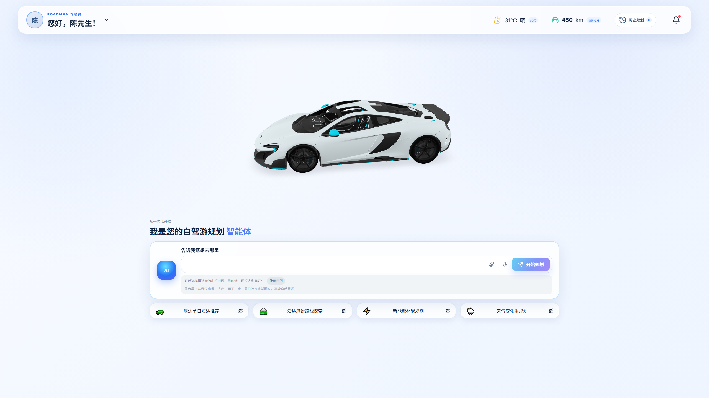

### Progressive Background Planning, Visible in Real Time

Planning is a long-running task lasting minutes: Redis + ARQ execute the LangGraph workflow, and SSE pushes each node's progress to the detail page in real time — top progress bar, route segments appearing on the map one by one, stage cards and activities generating item by item, and agent collaboration messages scrolling live on the right. Frontend animation pacing is decoupled from backend speed; historical trips are restored straight from the database without replaying "generating".

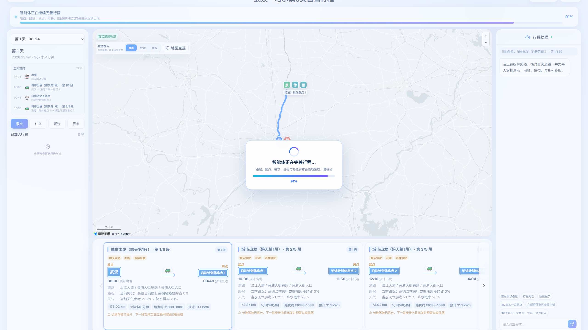

### Map & Day-by-Day Orchestration, Understandable at a Glance

Each day is a complete timeline: breakfast, departure, service-area rest and charging along the way, sightseeing stops, dining, lodging — with traffic, weather, tolls and energy estimates attached. The current stage's route is highlighted while others are dimmed; pan/zoom, stage switching and map point picking are supported. The planning page's left itinerary, right trip assistant and bottom stage details can each collapse independently; when the bottom bar is collapsed only the previous stage, current index and next stage remain, giving the map more space. Collapse state is remembered in the local browser.

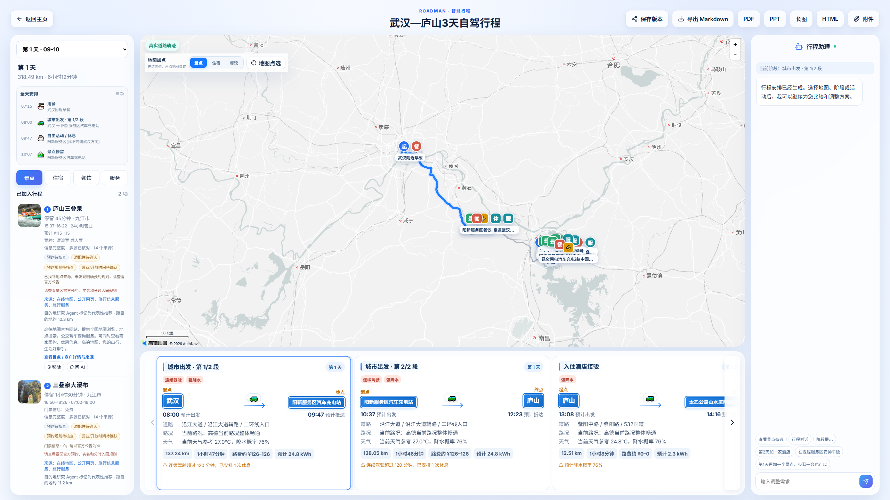

### Long-Distance Drives, Automatically Split into Relaxed Days

The biggest challenge for long EV trips is "can I actually reach the next charging station". RoadMan splits cross-day legs by a daily driving cap, inserting service-area rest, fuel/charge stops and overnight lodging along the way, continuing the next day — never cramming 24+ hours of driving into day one. Each leg continuously computes SOC before/after charging and at arrival from starting SOC, actual energy consumption, station power and dwell time, instead of resetting post-charge SOC to a fixed 80%. Risks like insufficient charging, overly long continuous driving or heavy rain appear in the itinerary as warnings and repair suggestions.

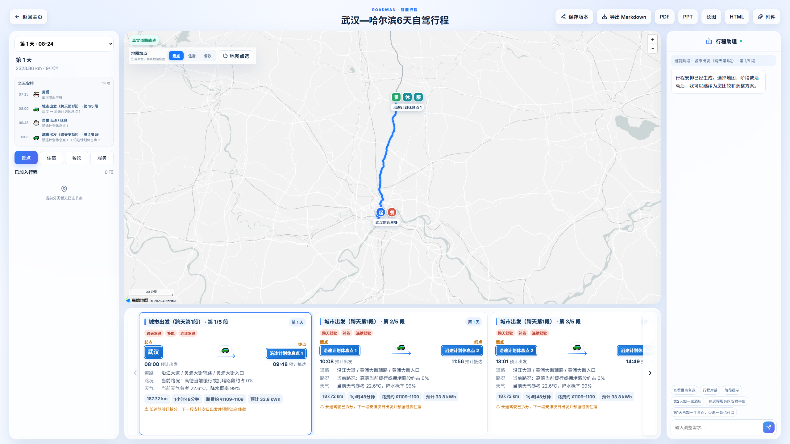

### Historical Plans, Pick Up Anytime

All trips are automatically saved as history and restored in seconds; batch delete and select-all are supported. In-progress trips can keep being tracked; failed or pending ones are clearly labeled.

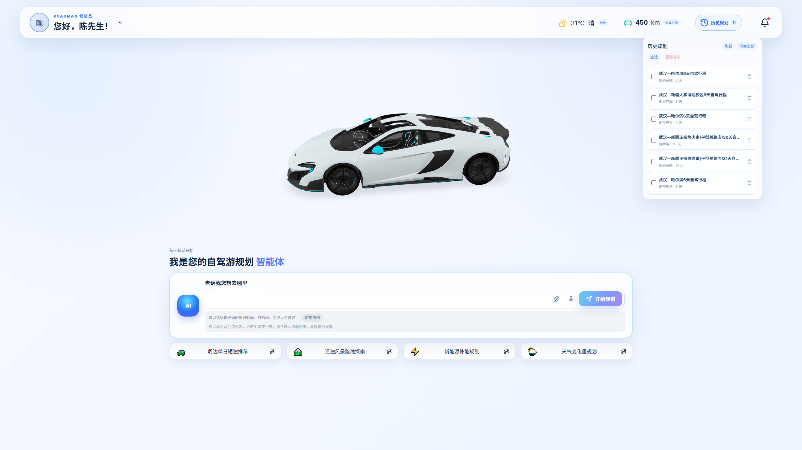

### Vehicle & Energy Context

The vehicle manager searches a real vehicle catalog and saves vehicles (range, battery capacity, seat count, etc.); planning uses the vehicle context to compute usable range and charging stops — EV, fuel and hybrid each get different planning strategies.

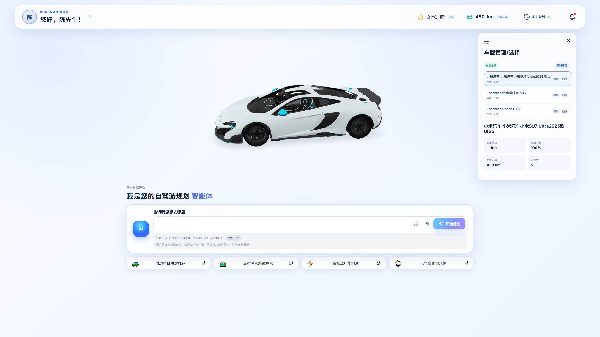

### Observable & Traceable

Every external capability call records its source, time and degradation status; the operations monitoring page shows request volume, latency, Skill calls and cache hits, plus the health of all external services. Estimates are never disguised as live facts, and success is never faked.

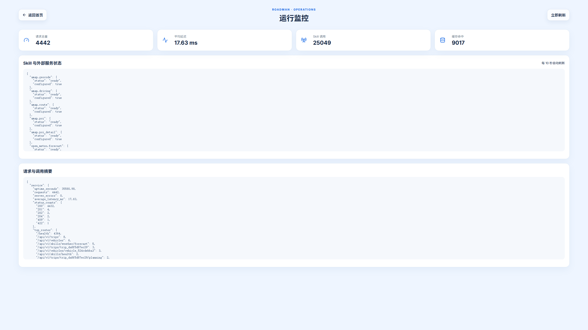

## Feature Close-ups

From a "decent-looking itinerary" to "actually executable" — hidden in every functional detail:

| Stage Card · Real Road Tracks | Cross-Day Driving Split |
| :---: | :---: |
| Origin/destination, roads, traffic, weather, tolls & energy estimates in one card; automatic rest insertion on driving-time overruns | Long trips split into multiple legs by the daily driving cap, with rest stops and charging stations scheduled item by item |
| 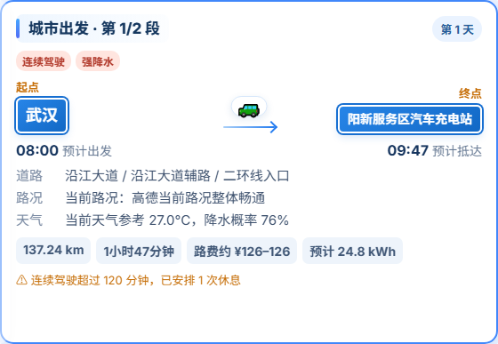 | 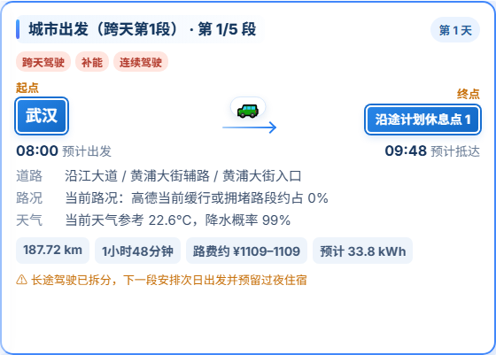 |

| Risk & Self-Driving Checks | Automatic Re-verification & Repair |
| :---: | :---: |
| Continuous driving, heavy rain, battery margin and night driving listed item by item; risks are traceable and explainable | Multi-source verification: source count, verification time, ticket price ranges, reservation & opening status annotated item by item |
| 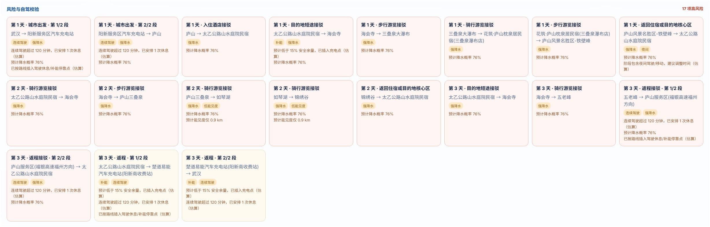 | 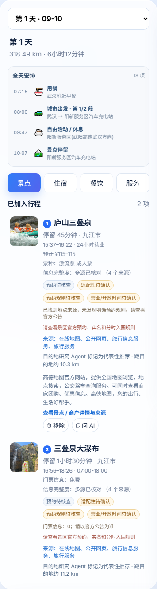 |

| Agent Collaboration · Trip Assistant | Map Point Picking & One-Click Export |
| :---: | :---: |
| One-click quick commands; natural-language edits → preview → confirm & apply; failures never persist to the database | Add points via map picking; export in Markdown / PDF / PPT / long image / HTML |
|  |  |


---

## Architecture Overview

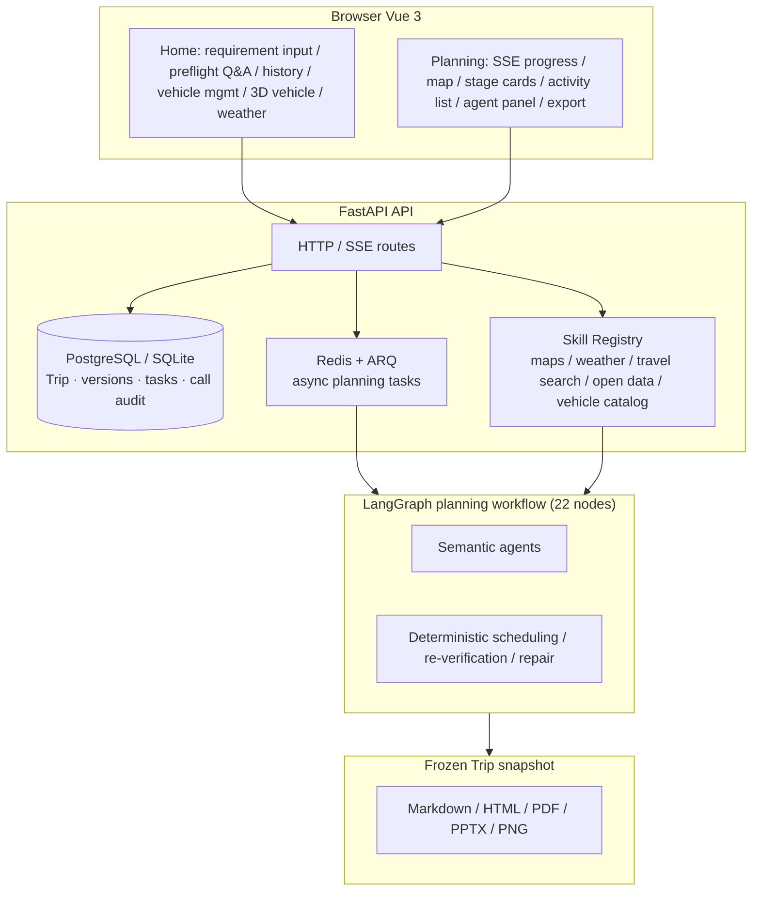

**Two-layer architecture**: semantic agents handle understanding, research, curation and collaboration (requirement extraction, destination research, POI curation, fitness re-verification, itinerary editing, event research); deterministic code handles coordinates, routes, time, energy, conflicts and hard safety rules. The model may make suggestions, but cannot override route closure or vehicle-safety conclusions.

**State ownership**: `Trip` is the canonical itinerary; `RoadManState` holds candidates and repair rounds during graph execution; ARQ jobs run in the background — the API never runs full planning inside a request thread; SSE only pushes displayable state, never keys or raw model output.

## Quick Start (Docker Compose)

> Prerequisite: install and start [Docker Desktop](https://www.docker.com/products/docker-desktop/).

```powershell
# 1. Prepare configuration
if (!(Test-Path .env)) { Copy-Item .env.example .env }

# 2. Edit .env, fill in at least two items (the rest as needed, see config table below)
#    DEEPSEEK_API_KEY=your DeepSeek API Key
#    AMAP_WEBSERVICE_KEY=your AMap WebService Key

# 3. Start (first build builds images and initializes the DB, takes a few minutes)
docker compose up -d --build

# 4. Verify
python deploy/api_smoke.py
```

Both `backend` and `worker` read `DEEPSEEK_API_KEY` from the `.env` at the project root — it is not overridden by an identically-named legacy environment variable on the host; both are pinned to the official Chat Completions endpoint and `deepseek-v4-flash`. `.env` is in the ignore rules; never commit or print the key.

A passing smoke script means containers, database, queue, API contract and currently reachable external capabilities have all been checked item by item. It does not mistake "travel information service legitimately has no inventory" for a failure; requirement understanding / semantic edits are validated separately with a valid DeepSeek key.

**Entry Points**

- Web workbench: <http://localhost:8080>
- Other devices on the LAN: `http://<host-LAN-IP>:8080`
- Backend API docs: <http://localhost:8000/docs>

**Minimal model-key check** (checks status only, never prints the key):

```powershell
Invoke-RestMethod https://api.deepseek.com/chat/completions -Method Post -Headers @{ Authorization = "Bearer $env:DEEPSEEK_API_KEY"; "Content-Type" = "application/json" } -Body (@{ model = "deepseek-v4-flash"; messages = @(@{ role = "user"; content = "return JSON: { ok: true }" }); response_format = @{ type = "json_object" }; thinking = @{ type = "enabled" }; reasoning_effort = "max" } | ConvertTo-Json -Depth 5)
```

A 401/403 means the account authorization or quota is unavailable; RoadMan will explicitly pause semantic steps rather than guessing locations by keywords.

**Common Ops Commands**

```powershell
docker compose ps                 # view service status
docker compose logs -f backend    # follow backend logs
docker compose down               # stop all services
docker compose up -d --build      # rebuild after code changes
```

Database backup & restore, HTTPS, LAN and troubleshooting: see [docs/operations.md](docs/operations.md).

## Configuration

All configuration lives in the root `.env` file; the full template with comments is in [.env.example](.env.example).

| Variable | Purpose | Required |
| --- | --- | --- |
| `DEEPSEEK_API_KEY` | Cloud agents for requirement understanding, destination research, semantic edits, etc. | Yes |
| `AMAP_WEBSERVICE_KEY` | Geocoding, POI, real route queries | Yes |
| `VITE_AMAP_JSAPI_KEY` | Real browser map (injected at build time; rebuild after changes) | Recommended |
| `VITE_AMAP_SECURITY_JS_CODE` | Browser map security key | Recommended |
| `FLYAI_API_KEY` | Travel search, lodging, dining supplement | Recommended |
| `OPENTRIPMAP_API_KEY` | International/open attraction data supplement | Optional |
| `DEEPSEEK_MODEL` | Model name, default `deepseek-v4-flash` | Optional |
| `DEEPSEEK_REASONING_EFFORT` | Reasoning depth, default `max` | Optional |
| `DEEPSEEK_THINKING` | Enable thinking mode, default `true` | Optional |
| `DEEPSEEK_API_URL` | Chat Completions endpoint | Optional |
| `ROADMAN_HTTP_PROXY` | Host proxy needed by containers to reach the internet, e.g. `http://host.docker.internal:7890` | Optional |

Missing non-required keys cause the corresponding capability to degrade automatically (e.g. a simplified map view when no browser map key is present) without affecting the main flow.

The DeepSeek API uses the OpenAI-compatible Chat Completions protocol: requests use `messages`, `response_format=json_object`, `thinking=enabled` and `reasoning_effort=max`; the response is read from `choices[0].message.content`; the model's private chain-of-thought is never stored. See [Chat Completions API](https://api-docs.deepseek.com/api/create-chat-completion/) and [Thinking Mode](https://api-docs.deepseek.com/guides/thinking_mode/).

## Local Development

Backend (Conda):

```powershell
conda env create -f environment.yml
conda activate roadman
pip install -r requirements.txt
$env:PYTHONPATH = 'backend'
alembic -c backend/alembic.ini upgrade head
uvicorn app.main:app --reload --port 8000
```

Frontend (separate terminal):

```powershell
cd frontend
npm install
npm run dev
```

Local development defaults to SQLite. Async planning depends on Redis and a worker; it's recommended to run infrastructure with Compose and only start services you need to debug on the host:

```powershell
docker compose up -d postgres redis worker
```

## Testing & Acceptance

```powershell
$env:PYTHONPATH = 'backend'
pytest backend/tests -q                  # backend tests

cd frontend
npm run test                             # frontend unit tests
npm run build                            # frontend production build
npm run test:e2e                         # frontend E2E (Playwright)

python deploy/api_smoke.py               # API smoke test against running containers
python deploy/full_journey_acceptance.py # full-journey acceptance (create→plan→edit→export)
python evaluation/run_evals.py           # requirement understanding evals (12 scenarios)
python evaluation/range_accuracy.py      # energy, equivalent range & arrival-SOC error baselines
python evaluation/safety_scenarios.py    # 12 categories: low battery, bad metadata, bad weather, service failures
.\deploy\semifinal-check.ps1             # one-click semifinal build, test, eval & evidence report
node deploy/semifinal_evidence.mjs       # generate 2560×1440 semifinal product/metric screenshots
```

Semifinal materials: [submission/GOAI_Boundless_Agents/semifinal/README.md](submission/GOAI_Boundless_Agents/semifinal/README.md). The range baseline is explicitly marked as simulated sensor replay; to audit real road data use `python evaluation/range_accuracy.py --input <real.json> --require-real` — simulated input is rejected.

Browser acceptance with real cloud agents does not block offline regression by default; enable explicitly once a valid key is configured:

```powershell
$env:ROADMAN_RUN_LIVE_AGENT_E2E = '1'
npm run test:e2e --prefix frontend -- tests/e2e/planning-agent.spec.ts
```

## Project Structure

```text
backend/     FastAPI + LangGraph backend, ARQ worker, DB migrations, tests
frontend/    Vue 3 + Vite frontend, E2E tests
shared/      JSON Schema contracts & example trips shared by frontend/backend
Skills/      External capability skill packs (AMap, weather, travel search, vehicles, attractions)
deploy/      Smoke & acceptance scripts, Nginx config, backup/restore
evaluation/  Requirement understanding, range error, safety degradation & full-journey evals
docs/        API contract, domain model, deployment & ops docs
submission/  Competition proposal & generated-audit tooling
```

## Documentation

- [project.md](project.md): system architecture, planning workflow, API & data boundaries
- [docs/README.md](docs/README.md): index of all maintenance docs
- [docs/api-contract.md](docs/api-contract.md): HTTP/SSE API contract
- [docs/mobility-and-poi-data-contract.md](docs/mobility-and-poi-data-contract.md): place facts, ticketing/reservation, parking, public transit & intercity schedule data contract
- [docs/operations.md](docs/operations.md): deployment, ops, backup/restore & troubleshooting
- [docs/safety-and-data-boundary.md](docs/safety-and-data-boundary.md): safety, degradation & data boundaries

## Usage Boundaries

Routes, weather, opening hours, tickets, schedules, traffic and prices may change. RoadMan records sources, times and degradation status, but exported results cannot replace real-time information from scenic areas, transport operators, road authorities or vehicle manufacturers. Please re-check reservations, road closures, severe weather, charging availability and transport schedules before departure.

RoadMan does not connect to or control vehicles. When weather, charging or route services fail, it shows explainable degradation and never presents estimated points or schematic routes as live facts; data collection, the 30-day attachment retention and cascade trip deletion are covered in [docs/safety-and-data-boundary.md](docs/safety-and-data-boundary.md).
