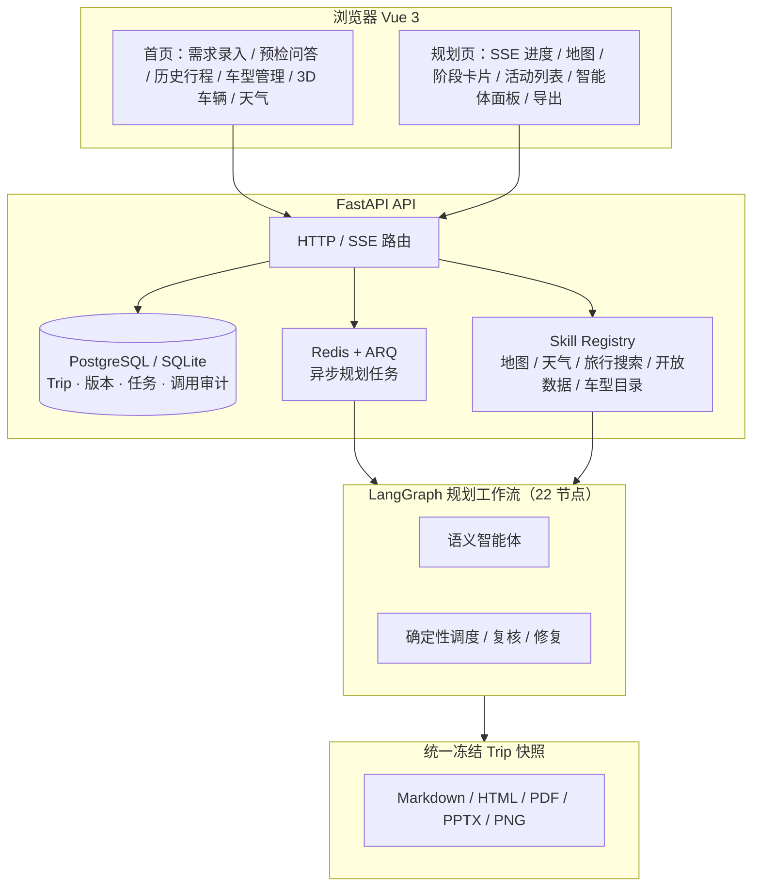

<div align="center">

# RoadMan

**把一句「我想去哪」，变成一本可执行的自驾路书**

> 多智能体自驾与中短途旅行规划工作台 —— 需求理解 · 目的地研究 · 真实路线 · 逐日编排 · 自动复核修复 · 可编辑可导出

</div>

[](https://fastapi.tiangolo.com/) [](https://langchain-ai.github.io/langgraph/) [](https://vuejs.org/) [](https://lbs.amap.com/api/javascript-api-v2/summary) [](https://www.postgresql.org/) [](https://redis.io/) [](https://docs.docker.com/compose/) [](#配置项) [](https://open-meteo.com/) [](https://www.flyai.com/) [](https://docs.pytest.org/) [](https://playwright.dev/)

---

**🌐 语言 / Language：** [**English**](README.en.md) | **中文**

---

## RoadMan 在解决什么问题

规划一次自驾旅行，通常要在地图、攻略、天气、酒店、充电桩和班次表之间来回切换，手动拼出一条「能走」的行程。真正恶心的是：拼完之后它可能 **根本走不了** —— 凌晨三点参观、全天空白、三餐缺失、酒店天天换、一天 18 小时车程、电量到不了下一个充电站。这些「好看但不可执行」的行程，正是大模型一次性生成的老毛病。

RoadMan 的做法是：**把「内容建议」放进可执行工作流**。一句话需求交给一群分工明确的智能体去理解、研究、取舍、编排，而路线坐标、时间窗口、连续驾驶、电量余量、三餐住宿、返程闭环这些硬规则由确定性程序兜底；复核发现问题会自动重排最多三次，仍未消解的规划器检查项以“出发前提醒”随当前草案交付，不用失败弹窗阻塞查看；用户改一句「把第二天换成更安静的地方」，系统先给出影响预览，确认后统一重算，再校验一遍才允许导出。

它不是实时导航，也不是车辆控制 —— 而是出发前与途中调整的**规划助手**：懂车、懂路、懂天气，也懂你。

## 完整旅程，一次看完

从「自然语言需求」到「可执行、可修改、可验证的行程」，再落到 Markdown / HTML / PDF / PPTX / 长图多格式交付：

<!--
  ██ 预留位置：智能体规划过程动态 GIF ██
  1) 录制需求输入 → 预检确认 → 后台渐进规划（地图逐段出现、阶段卡片逐项生成）
     → 复核修复提示 → 完成后的语义编辑预览与导出过程；
  2) 将 gif 文件保存为 docs/screenshots/agent-planning.gif；
  3) 取消下方两行注释（去掉 <div align="center"> 与 </div> 行首的 HTML 注释标记）即可显示。
  建议宽度 width="85%"，保持与页面其他截图比例一致。
-->
<!--
<div align="center">
  
</div>
-->

## 功能亮点

### 一句话，开始出发

用自然语言说出「**周六早上从武汉出发，去庐山两天一夜，周日晚八点前回来，喜欢自然景观**」。系统先做需求核对与逐项追问，确认后才启动后台规划；也可以附加图片、PDF、DOCX、Markdown 或 XLSX 作为上下文。首页快捷需求直接覆盖情侣周边游、沿途慢游、新能源补能和雨天改排等真实任务；地点理解能区分「新疆」「南京」「西藏和新疆」这类行政区、城市与多目的地，不会把目的地猜成同名餐馆或校园。天气卡在用户授权后按浏览器当前位置请求多源预报并解析城市标签；四个公开天气源并行查询，首个可用源立即展示，其余源的成功/降级状态随响应保留。临时定位失败时只使用本机浏览器记住的上次位置，未取得位置时保持不可用，不会静默切到固定城市。


### 后台渐进规划，实时可见

规划是持续数分钟的长任务：Redis + ARQ 执行 LangGraph 工作流，SSE 把每个节点的进度实时推送到详情页。等待界面依次聚焦需求约束、地点与交通搜索、候选筛选、多智能体协作、上下文补齐、全天编排和最终复核，每一幕只保留一个清晰主视觉；进入工作台后，顶部进度、地图路线、阶段卡、活动和协作消息继续随真实节点推进。前端动画节奏与后台速度分离，历史行程直接从数据库恢复，不重播「生成中」。


### 地图与逐日编排，看起来就懂

每一天是一条完整时间线：早餐、出发、沿途服务区休息与充电、景点停留、餐饮、住宿，附带路况、天气、路费与能耗估算。景点候选先合并入口、停车场等同一景区变体，再综合研究优先级、适配评分与当前路线距离选入；活动卡只采用当日路线实际经过的候选，避免地图和日程各说各话。每日游览路线会在合理时段回到住宿基点，同一地点或近距离锚点不生成零距离返程卡。当前阶段路线高亮、其他灰显，支持平移缩放、阶段切换与地图选点。规划页左侧日程、右侧行程助理和底部阶段详情都可独立收起；底栏收起后只保留上一段、当前序号和下一段，让地图获得更大空间，折叠状态会在本机浏览器保留。


### 长途自驾，自动拆成从容的跨天

新能源长途最考验「能不能顺利到达下一个充电站」。RoadMan 按每日驾驶上限拆分跨天路段，沿途插入服务区休息、加油/充电补能与过夜住宿，次日再继续，不会把 24 小时以上驾驶压在第一天。每段按起始 SOC、实际能耗、站点功率与停留时间连续计算充前/充后/到达 SOC，不再把充电后电量固定重置为 80%。补能不足、连续驾驶过久、强降水等风险会以警告与修复建议的形式出现在行程里。


### 历史规划，随时接着用

所有行程自动保存为历史规划，秒开恢复，支持批量删除与全选操作；进行中的行程可继续追踪，失败或待继续的会明确标注。


### 车辆与能源上下文

车型管理先查询主车型目录；具体版本缺失或只命中模糊结果时，再动态并行查询多个公开车型数据源，覆盖纯电、混动与燃油车的续航、能耗、电池、充电、座位和尺寸等可用字段。结果保留具体版本、原始来源和缺失/估算标记，由用户确认后保存；规划时按车辆上下文计算可用续航与补能节点，纯电、燃油、混动采用不同策略。


### 可观测、可追溯

每一次外部能力调用都记录来源、时间与降级状态；运行监控页给出请求量、延迟、Skill 调用与缓存命中，以及全部外部服务健康状况。不把估算点冒充实时事实，不伪造成功。


## 功能特写

从「看起来像样的行程」到「真实可执行」，藏在每个功能细节里：

| 阶段卡片 · 真实道路轨迹 | 跨天驾驶拆分 |
| :---: | :---: |
| 起点/终点、道路、路况、天气、路费与能耗估算一卡俱全；连续驾驶超时自动插入休息 | 长途按每日驾驶上限拆成多段，沿途休息点与补能站逐项排入 |
|  |  |

| 风险与自驾校验 | 自动复核修复 |
| :---: | :---: |
| 连续驾驶、强降水、电量余量、夜间驾驶逐项列出，风险可追可解释 | 多源信息核验：来源数、核验时间、票价区间、预约与营业状态逐项标注 |
|  |  |

| 智能体协作 · 行程助理 | 地图选点与一键导出 |
| :---: | :---: |
| 快捷指令一键唤起，自然语言修改 → 预览 → 确认应用，失败不落库 | 地图加点选点；Markdown / PDF / PPT / 长图 / HTML 多格式导出 |
|  |  |


---

## 架构总览



**双层架构**：语义智能体负责理解、研究、取舍与协作（需求抽取、目的地研究、POI 策展、适配复核、行程编辑、事件研究）；确定性程序负责坐标、路线、时间、能耗、冲突与硬安全规则。模型可以提建议，但不能覆盖路线闭环与车辆安全结论。

**状态所有权**：`Trip` 是 canonical 行程；`RoadManState` 保存图执行中的候选与修复轮次；ARQ job 在后台执行，API 不在请求线程内跑完整规划；SSE 只推送可展示状态，不暴露密钥或模型原始输出。

## 快速开始（Docker Compose）

> 前置要求：安装并启动 [Docker Desktop](https://www.docker.com/products/docker-desktop/)。

```powershell
# 1. 准备配置
if (!(Test-Path .env)) { Copy-Item .env.example .env }

# 2. 修改 .env，至少填入两项（其余按需，见下方配置表）
#    LLM_API_KEY=你的模型服务 API Key
#    AMAP_WEBSERVICE_KEY=你的高德 WebService Key

# 3. 启动（首次构建镜像并初始化数据库，耗时几分钟）
docker compose up -d --build

# 4. 验证
python deploy/api_smoke.py
```

`backend` 和 `worker` 都从项目根目录的 `.env` 读取统一的 `LLM_*` 配置，不会把某个供应商或模型写死在智能体代码里。通过 `LLM_PROVIDER`、`LLM_API_URL`、`LLM_API_KEY`、`LLM_MODEL` 和 `LLM_API_STYLE` 即可切换服务；默认请求使用 OpenAI 兼容 Chat Completions 格式。`.env` 已加入忽略规则，请勿提交或打印密钥。

冒烟脚本通过即表示容器、数据库、队列、接口契约和当前可访问的外部能力已完成逐项检查。它不会把「旅行信息服务合法无库存」误判成故障；需求理解/语义编辑会用当前 `LLM_*` 配置单独验证。

**使用入口**

- Web 工作台：<http://localhost:8080>
- 局域网内其他设备：`http://本机局域网IP:8080`
- 后端接口文档：<http://localhost:8000/docs>

**模型 Key 最小验证**（只检查状态，不打印 Key）：

```powershell
Invoke-RestMethod $env:LLM_API_URL -Method Post -Headers @{ Authorization = "Bearer $env:LLM_API_KEY"; "Content-Type" = "application/json" } -Body (@{ model = $env:LLM_MODEL; messages = @(@{ role = "user"; content = "return JSON: { ok: true }" }); response_format = @{ type = "json_object" } } | ConvertTo-Json -Depth 5)
```

返回 401/403 说明账号授权或额度不可用；RoadMan 会明确暂停语义步骤，不会用关键词猜地点。

**常用运维命令**

```powershell
docker compose ps                 # 查看服务状态
docker compose logs -f backend    # 跟踪后端日志
docker compose down               # 停止全部服务
docker compose up -d --build      # 更新代码后重新构建
```

数据库备份与恢复、HTTPS、局域网与排障详见 [docs/operations.md](docs/operations.md)。

## 配置项

所有配置写入根目录 `.env` 文件，完整模板与注释见 [.env.example](.env.example)。

| 变量 | 用途 | 是否必需 |
| --- | --- | --- |
| `LLM_API_KEY` | 需求理解、目的地研究、语义编辑等云端智能体 | 是 |
| `AMAP_WEBSERVICE_KEY` | 地理编码、POI、真实路线查询 | 是 |
| `VITE_AMAP_JSAPI_KEY` | 浏览器端真实地图（构建时注入，改动后需重新构建） | 推荐 |
| `VITE_AMAP_SECURITY_JS_CODE` | 浏览器地图安全密钥 | 推荐 |
| `FLYAI_API_KEY` | 旅行搜索、住宿、餐饮补充 | 推荐 |
| `OPENTRIPMAP_API_KEY` | 国际/开放景点数据补充 | 可选 |
| `LLM_PROVIDER` | 供应商标识，仅用于配置与审计 | 可选，默认 `ollama_cloud` |
| `LLM_MODEL` | 模型名 | 是 |
| `LLM_API_STYLE` | 请求协议：`openai` 或 `ollama_generate` | 可选，默认 `openai` |
| `LLM_THINKING` | 是否启用供应商支持的思考模式 | 可选，默认 `false` |
| `LLM_MAX_TOKENS` / `LLM_TIMEOUT_SECONDS` | 输出上限与请求超时 | 可选 |
| `LLM_API_URL` | 完整的模型接口地址 | 是 |
| `ROADMAN_HTTP_PROXY` | 容器访问外网所需的宿主机代理，如 `http://host.docker.internal:7890` | 可选 |

缺少非必需 Key 时对应能力自动降级（例如无浏览器地图 Key 时使用简化地图视图），不影响主流程。

语义智能体统一采用 OpenAI 兼容 Chat Completions 请求/响应适配层：请求使用 `messages` 与可选 `response_format=json_object`，响应读取 `choices[0].message.content`；同时兼容明确配置的 Ollama 原生 `response` 返回。供应商、地址、模型和密钥均来自 `LLM_*` 配置，模型私有思维链不保存。

## 本地开发

后端（Conda）：

```powershell
conda env create -f environment.yml
conda activate roadman
pip install -r requirements.txt
$env:PYTHONPATH = 'backend'
alembic -c backend/alembic.ini upgrade head
uvicorn app.main:app --reload --port 8000
```

前端（另开终端）：

```powershell
cd frontend
npm install
npm run dev
```

本地开发默认使用 SQLite。异步规划依赖 Redis 与 worker，建议用 Compose 跑基础设施，只在宿主机启动需要调试的服务：

```powershell
docker compose up -d postgres redis worker
```

## 测试与验收

```powershell
$env:PYTHONPATH = 'backend'
pytest backend/tests -q                  # 后端测试

cd frontend
npm run test                             # 前端单元测试
npm run build                            # 前端生产构建
npm run test:e2e                         # 前端 E2E（Playwright）

python deploy/api_smoke.py               # 运行中容器 API 冒烟
python deploy/full_journey_acceptance.py # 完整旅程验收（建行程→规划→修改→导出）
python evaluation/run_evals.py           # 需求理解评测（12 条场景）
python evaluation/range_accuracy.py      # 能耗、等效续航与到达 SOC 误差基准
python evaluation/safety_scenarios.py    # 12 类低电量、异常元数据、恶劣天气与服务失败
.\deploy\semifinal-check.ps1             # 复赛一键构建、测试、评测与证据报告
node deploy/semifinal_evidence.mjs       # 生成 2560×1440 复赛产品/指标截图
```

复赛专项材料见 [submission/GOAI_Boundless_Agents/semifinal/README.md](submission/GOAI_Boundless_Agents/semifinal/README.md)。续航基准明确标记为模拟传感器回放；需要审核真实道路数据时使用 `python evaluation/range_accuracy.py --input <real.json> --require-real`，模拟输入会被拒绝。

真实云端智能体的浏览器验收默认不阻断离线回归；配置有效 Key 后显式开启：

```powershell
$env:ROADMAN_RUN_LIVE_AGENT_E2E = '1'
npm run test:e2e --prefix frontend -- tests/e2e/planning-agent.spec.ts
```

## 项目结构

```text
backend/     FastAPI + LangGraph 后端、ARQ worker、数据库迁移、测试
frontend/    Vue 3 + Vite 前端、E2E 测试
shared/      前后端共享的 JSON Schema 契约与示例行程
Skills/      外部能力技能包（高德、天气、旅行搜索、车型、景点）
deploy/      冒烟与验收脚本、Nginx 配置、备份恢复
evaluation/  需求理解、续航误差、安全降级与完整旅程评测
docs/        接口契约、领域模型、部署运维等文档
submission/  参赛方案书与生成审计工具
```

## 文档

- [project.md](project.md)：系统架构、规划工作流、接口与数据边界
- [docs/README.md](docs/README.md)：全部维护文档索引
- [docs/api-contract.md](docs/api-contract.md)：HTTP/SSE 接口契约
- [docs/mobility-and-poi-data-contract.md](docs/mobility-and-poi-data-contract.md)：地点事实、票务预约、停车、公共交通与跨城班次数据契约
- [docs/operations.md](docs/operations.md)：部署运维、备份恢复与排障
- [docs/safety-and-data-boundary.md](docs/safety-and-data-boundary.md)：安全、降级与数据边界

## 使用边界

路线、天气、开放时间、票务、班次、路况与价格可能变化。RoadMan 会记录来源、时间和降级状态，但导出结果不能替代景区、交通运营方、道路管理部门或车辆厂商的实时信息。出发前请再次核对预约、封路、恶劣天气、补能可用性及交通班次。

RoadMan 不连接或控制车辆。天气、补能与路线服务失败时会显示可解释降级，不把估算点或示意路线冒充实时事实；数据收集、30 天附件保留和行程级联删除范围见 [docs/safety-and-data-boundary.md](docs/safety-and-data-boundary.md)。
### 交通与油价公开备选

班次查询会并行调用多个数据源、按班次号和时间去重后择优。火车使用主旅行信息服务与 `TRAIN_FALLBACK_URL`；航班使用主服务、`FLIGHT_FALLBACK_API_KEY` 对应的备选源与可选的 `AVIATIONSTACK_API_KEY`。只有同时带真实班次号、起终站场和可解析时刻的结果才能进入行程；所有数据源均失败时返回可操作的不可用原因，不生成“机场待确认”或“航班号未返回”之类伪班次。

交通默认规则是：用户没有说交通方式时，跨城与市内全程使用驾车；用户明确说飞机、高铁或火车往返时，跨城使用真实班次，目的地市内再使用公共交通/步行接驳。系统不会因为时间窗口较短而擅自把默认自驾改成飞机或火车。默认使用非思考模式（`LLM_THINKING=false`）。
