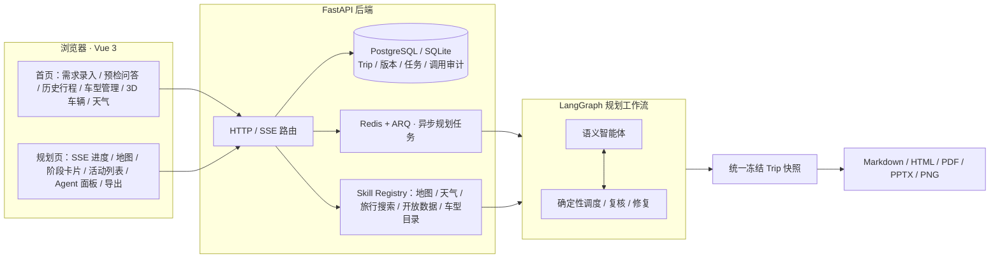

<div align="center">

# RoadMan · 项目说明

多智能体自驾行程工作台 — 代码仓库维护入口

</div>

[](https://www.python.org/)
[](https://fastapi.tiangolo.com/)
[](https://langchain-ai.github.io/langgraph/)
[](https://vuejs.org/)
[](https://www.postgresql.org/)
[](https://redis.io/)
[](https://docs.docker.com/compose/)

> 本文是代码仓库的维护入口，描述当前实现与维护边界。安装、密钥与验证命令见 [README.md](README.md)；详细接口契约见 [docs/api-contract.md](docs/api-contract.md)。

> **近期数据链路完善**：景点、餐饮和住宿在排入行程后会再次精确核验——地图 POI 详情、旅行门票服务和公开网页分别提供事实、票务和描述来源，并在 `Activity` 中保留来源数、核验时间、营业时间确认状态、门票/预约状态、票价区间、停车费区间、官网与详情链接。公共交通阶段保留线路与上下车站；火车/飞机阶段保留真实车次号或航班号、站场/机场、时间、座席、价格和详情链接。无返回值时显示明确的未知状态，不使用「高铁/航班」充当虚构编号。接口清单和失败边界见 [docs/mobility-and-poi-data-contract.md](docs/mobility-and-poi-data-contract.md)。

## 1. 当前状态

RoadMan 已形成从「自然语言需求」到「可确认、可追踪、可编辑、可导出的行程」的完整闭环：后端 LangGraph 规划工作流经 ARQ + Redis 异步执行，前端提供首页、规划进度、详情地图、阶段卡片、候选推荐和 Agent 编辑面板。

已落地的主线能力：

- Trip 数据按 `天 → MovementStage / Activity` 组织，使用 PostgreSQL（生产/Docker）或 SQLite（本地/测试）和 Alembic 迁移。
- `preflight` 先由需求理解智能体提取语义需求、日期/地点/交通约束并进行必要追问；用户确认前不会开始规划。地点意图不再使用字符串/城市关键词兜底：智能体不可用或返回非法地点结构时明确暂停，不向地图发送猜测值。离线逻辑只负责显式日期格式、相对日历结构和数值边界，不负责猜地点或意图。
- 明确的「出发—抵达」时钟窗口作为硬约束复核；返程目标允许 15 分钟静默误差、半天内只给 warning，超过半天才阻断。
- 跨海只在用户明确写出跨海语义时保留安全约束；轮渡/飞机/桥梁方式不由模型凭空猜定，需用户确认或明示。
- LangGraph 规划工作流执行需求抽取、目的地研究、目的地策划单、路线、POI、天气、补能/服务、每日复核和持久化节点。省份/城市/多目的地先由研究智能体检索必去地标与代表性美食，再由目的地策划智能体按地理片区生成每日主轴，最后交给路线智能体执行。
- Skill Registry 统一接入地图、天气、旅行信息、开放数据、车型目录和语义模型；每次调用可审计、可缓存并可降级。旅行信息服务的住宿结果会按目的地坐标过滤异地卡片；无库存时保留未知状态。
- 高德路线优先使用真实道路 geometry；驾车不可用时按策略尝试骑行、步行或公共交通，全部失败返回 `ROUTE_UNAVAILABLE`，前端灰色虚线只表示不可用提示。
- 当前阶段路线高亮，其他路线灰显；地图支持平移/缩放、阶段切换和点选；路线几何跟随地图变换。
- 规划页左侧日程、右侧行程助理和底部阶段详情可独立折叠；底栏折叠后只保留阶段序号及前后切换，状态写入浏览器本地存储，展开不会重建组件或丢失编辑上下文。
- 每日复核与最终验证由确定性调度和校验器执行，覆盖三餐、住宿、时段、活动冲突、连续驾驶、补能和返程闭环；发现可修复问题时自动重排并循环复核（最多 4 轮），仍无法满足的硬约束才交由用户处理。明确返程到达时刻会在排程前预留道路、补能和驾驶休息缓冲，避免深度驾驶拆分后越过截止时间。长途自驾会按每日最多 9 小时拆成跨天路段，在沿途服务区/酒店插入休息与过夜住宿，次日 08:00 再继续，不会把 24 小时以上驾驶压在第一天。
- 新能源阶段使用连续 SOC 账本：`starting_percent → consumed_percent → before_replenishment_percent → replenished_amount → after_replenishment_percent → remaining_percent`。补能量优先取供应商实测能量，其次按站点功率 × 停留时间估算，最后才使用带 `calculation_basis` 的保守降级；跨天拆分继承上一段到达 SOC，不再在补能后写死 80%。
- 编辑采用 `preview → apply/reject → rollback` 的 PlanPatch 两阶段流程，支持自然语言修改、地图选点、候选景点/酒店/餐饮加入或替换。
- 规划完成后才能导出 Markdown、HTML、PDF、PPTX、PNG；历史行程从数据库恢复，不重新播放规划动画。
- 车辆管理支持 CRUD，并提供 `carinfo.catalog` 真实车型搜索；本地车型字段由用户确认后保存。
- 请求 ID、追踪 ID、速率限制、Skill 调用记录、服务指标和 Docker 健康检查已接入。

> 长途自驾场景（武汉 → 哈尔滨 6 天）：每日驾驶上限拆分、沿途休息与补能、跨天过夜住宿编排。


## 2. 系统架构



状态所有权：

- `Trip` 是用户可见的 canonical 行程，整份 JSON 存于 `trips.document`。
- `RoadManState` 保存图执行中的请求、候选、来源、工具结果、进度与修复次数。
- ARQ job 在后台执行规划，API 不在请求线程内跑完整规划。
- SSE 只传递可展示的阶段进度，不暴露密钥、内部 prompt 或模型原始输出。
- 每次编辑先产生 `PlanPatch`，确认前不改变 canonical Trip；应用前保存备份，支持回滚。

## 3. 规划工作流

主图节点（`backend/app/planning/graph.py`，22 个节点）按以下顺序执行：

```text
load_context
→ extract_trip_request
→ research_events
→ apply_defaults
→ validate_required_fields
  ├─ 缺信息 → generate_clarification → END
  └─ 可规划 → build_base_route
→ split_into_days
→ discover_tourism
→ build_local_routes
→ build_stages
→ load_vehicle_profile
→ discover_services
→ sample_weather
→ review_tourism_suitability
→ enrich_deep_drive（每日驾驶上限、服务区/补能、跨天住宿）
→ schedule_tourism
→ review_daily_schedule
→ verify_plan
  ├─ 可修复且未超过 4 轮 → repair_plan → verify_plan
  ├─ 不可修复 → 保存失败原因，交由用户处理
  └─ 通过 → render_markdown → persist_trip → END
```

语义智能体（`backend/app/planning/llm.py`）负责理解与取舍：需求抽取、目的地范围/多目的地识别、目的地研究、目的地计划单、需求复核、行程编辑、POI 策展、POI 排序、适配复核、特殊事件研究。路线、坐标、能耗、时间冲突与闭环由工具和确定性校验器负责，模型不能覆盖硬安全结论；若目的地字段类型不合法，会再次调用需求智能体修复，禁止把数组字符串或行政区误送成附近餐馆/校园。

`repair_plan` 会真正重新执行排程与复核：从策展候选重建三餐/住宿/景点，归一化供应商返回的重叠时间，再把结果交回 `verify_plan` 重新校验。

## 4. 核心运行流程

### 4.1 需求到规划

1. 前端提交 `POST /api/v1/trips/preflight`。
2. 需求理解智能体解释地点、日期、人数、交通方式、偏好和特殊活动，并返回 `destination_names` 与 `destination_scope`；确定性代码只校验日期格式和安全边界，不猜地点。
3. 对省份、城市或多目的地，目的地研究智能体并行检索公开网页、旅行信息服务和开放数据；目的地策划智能体根据证据生成分区、景点、三餐与住宿区域的计划单。
4. 命名事件（例如天文现象）触发带来源的研究，返回活动窗口和待确认项。
5. 所有问题解决后用户确认；前端创建 Trip 并调用 `/{trip_id}/planning/start`。
6. Worker 执行 LangGraph，阶段进度写入规划状态/Job，并通过 `planning/events` SSE 推送。
7. 行程逐步持久化；每日复核和最终验证通过后才将 Trip 标为 `completed`。

### 4.2 编辑到重算

自然语言编辑先由编辑智能体解释为候选操作。后端创建 PlanPatch 预览并计算影响日期/阶段、时间变化和路线重算范围。只有用户确认 `apply` 才写入 canonical Trip；失败不写入，并保留可回滚版本。多次局部增删改可累积，用户点击「重新规划路线」后统一重建本地阶段、跨天衔接与返程闭环，再运行完整校验；重排完成前禁止导出。

### 4.3 路线降级

`amap.route` 接受 `preferred_mode` 和 `allowed_fallback_modes`。真实 geometry 优先；无 geometry 的结果不作为道路使用。跨城驾车失败时不会错误地改成市内公交，只有请求允许且起终点同城才尝试公共交通；所有模式失败返回结构化错误。自驾行程的市内阶段继承驾车方式，仅在道路不可驾车或景区步行接驳时允许步行降级。

## 5. 目录职责

```text
backend/app/
  api/          FastAPI 路由与请求边界
  domain/       Pydantic 领域模型
  planning/     LangGraph、需求提取、研究、编排、复核、编辑
  skills/       第三方能力 Adapter 与 Registry
  repositories/ 持久化与版本读写
  services/     队列、SSE、导出、审计和观测
frontend/src/
  views/        首页、规划/详情页、运维页
  components/   地图、活动列表、Agent 面板
  stores/       Pinia 行程状态
shared/
  schemas/      跨进程 JSON Schema（由 backend/scripts/export_schemas.py 生成）
  examples/     示例行程快照
deploy/         冒烟与验收脚本、Nginx、备份恢复
evaluation/     需求理解、续航误差、安全降级、耗时与 Token 指标评测
docs/           当前接口、模型、运行和降级说明
Skills/         provider skill 指南与本地开发参考（不放密钥）
```

## 6. 接口概览

详细字段以 [docs/api-contract.md](docs/api-contract.md) 和 OpenAPI 为准。

| 领域 | 主要接口 |
| --- | --- |
| 行程 | `POST/GET /api/v1/trips`、`GET/PATCH/DELETE /api/v1/trips/{id}` |
| 预检 | `POST /api/v1/trips/preflight` |
| 规划 | `POST /api/v1/trips/{id}/planning/start`、`GET /planning`、`POST /planning/clarifications`、`GET /planning/events` |
| 编辑 | `/editing/interpret`、`/editing/confirm-replan`、`/patches/preview*`、`/patches/{patch_id}/apply|reject|rollback` |
| 导出 | `/roadbook`、`.html`、`.pdf`、`.pptx`、`.png`（仅 completed） |
| 资源 | `/recommendations`、`/risks`、`/services`、附件与版本接口 |
| Skill | `/api/v1/skills/health`、`/calls`、`/metrics` 及 amap/weather/flyai/opentripmap/carinfo 路由 |
| 车辆 | `POST/GET /api/v1/vehicles`、`GET/PATCH/DELETE /api/v1/vehicles/{id}` |
| 任务/运维 | `/api/v1/jobs`、`/api/v1/ops/metrics` |

统一错误格式含 `code`、`message`、`details`、`request_id`；响应回传 `X-Request-ID` 和 `X-Trace-ID`。

## 7. Provider 与凭据

| 能力 | Adapter | 凭据/降级 |
| --- | --- | --- |
| 高德地理/路线/POI | `amap.*` | `AMAP_WEBSERVICE_KEY`；无 key 返回 `SKILL_NOT_CONFIGURED` |
| 高德浏览器地图 | AMap JSAPI | 构建参数 `VITE_AMAP_*`；无 key 使用 Mock 地图 |
| 天气 | `open_meteo.forecast` | 无需 key；失败保留明确估算/不可用标记 |
| 旅行信息搜索 | 旅行信息服务 Adapter | `FLYAI_API_KEY` 和 CLI；失败降级为其他来源，不伪造结果 |
| 景点补充 | `opentripmap.nearby` | `OPENTRIPMAP_API_KEY`；结果需来源追溯 |
| 车型目录 | `carinfo.catalog` | 远端目录失败时返回可解释的空结果 |
| 语义智能体 | DeepSeek 官方 Chat Completions | `DEEPSEEK_API_KEY`、`DEEPSEEK_MODEL=deepseek-v4-flash`、`DEEPSEEK_REASONING_EFFORT=max`、`DEEPSEEK_THINKING=true`；未配置或请求失败时暂停语义步骤，离线逻辑只补显式日历结构，不猜地点 |

所有凭据通过环境变量注入；`.env`、本地凭据文件、数据库、上传与验收产物均被 Git 忽略。日志和 SSE 不记录密钥、附件原文或模型私有输出；调用审计只保存 adapter、耗时、成功、缓存、错误码和来源摘要。

## 8. 数据、队列和部署

- PostgreSQL 保存 Trip、版本、规划状态、任务、技能调用和上传文件元数据。
- Redis + ARQ 执行异步规划；API 与 Worker 共享规划状态。
- 上传内容在 `UPLOAD_DIR`，数据库只保存安全文件名和元数据；扩展名/MIME 白名单见配置。
- 删除单条行程执行不可恢复的级联硬删除：同步清理 Trip、消息/规划状态、版本、任务、行程级 Skill 调用、附件元数据和安全上传目录内的实体文件；系统级健康审计不随单条行程删除。
- DeepSeek 调用审计只记录智能体角色、成功状态、耗时和官方 usage Token，不保存 prompt、回答或私有推理文本；`/api/v1/ops/metrics` 汇总平均/P95 延迟、成功率与 Token 用量。
- Compose 入口是 `8080`，后端容器内部 `8000`；前端 Nginx 反代 `/api` 到后端。
- 通过 `CORS_ORIGINS`、`POSTGRES_*`、`ROADMAN_HTTP_PROXY` 等变量覆盖部署参数。
- 备份恢复脚本在 `deploy/scripts/`（`backup.ps1` / `restore.ps1`）。

运行细节和 provider 检查命令见 [docs/operations.md](docs/operations.md)。

## 9. 验证清单

提交前至少执行：

```powershell
$env:PYTHONPATH = 'backend'
python -m compileall -q backend/app backend/tests
pytest backend/tests -q
python evaluation/range_accuracy.py
python evaluation/safety_scenarios.py
cd frontend
npm run test
npm run build
npm run test:e2e
```

需要真实 provider 时，再执行 Docker 健康检查、`deploy/api_smoke.py` 和对应 Skill API 冒烟。没有凭据的环境也必须返回可解释的降级结果；语义智能体不可用时不能把关键词结果冒充模型理解。完整旅程与编辑重规划验收脚本见 `deploy/`；需求理解评测见 `evaluation/`。

## 10. 维护原则

1. 语义判断交给模型；显式日期、数值、坐标、路线、能耗和冲突必须经过结构化校验。
2. 外部调用失败必须返回可解释降级，不得静默伪造成功。
3. 路线没有真实 geometry 时不得画成真实道路；名称相同也要结合坐标再合并。
4. 所有写入式编辑必须先预览；失败不得破坏 canonical Trip。
5. 可自动修复的问题由确定性调度与修复循环处理，只有缺少授权、选择或安全硬约束时才要求用户介入。
6. 不把 provider 原始密钥、模型私有输出或第三方响应中的敏感字段写入日志、SSE 或导出文件。
7. 任何外部数据都带来源和时间；估算值必须显式标记，不能冒充实时结果。
8. 文档只保留当前契约和可复现操作。
