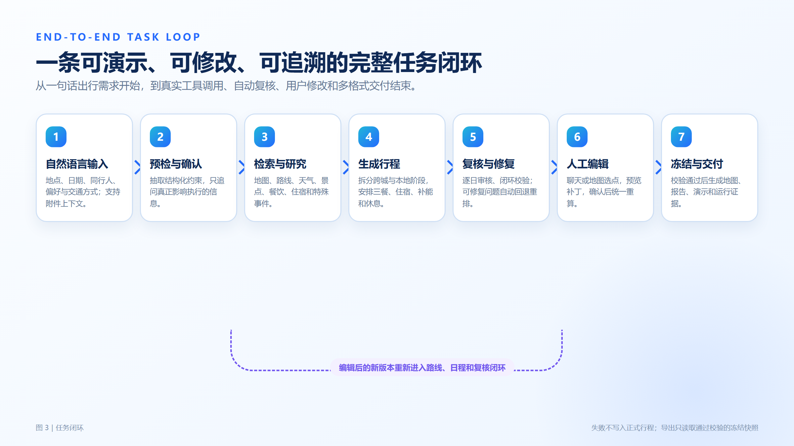
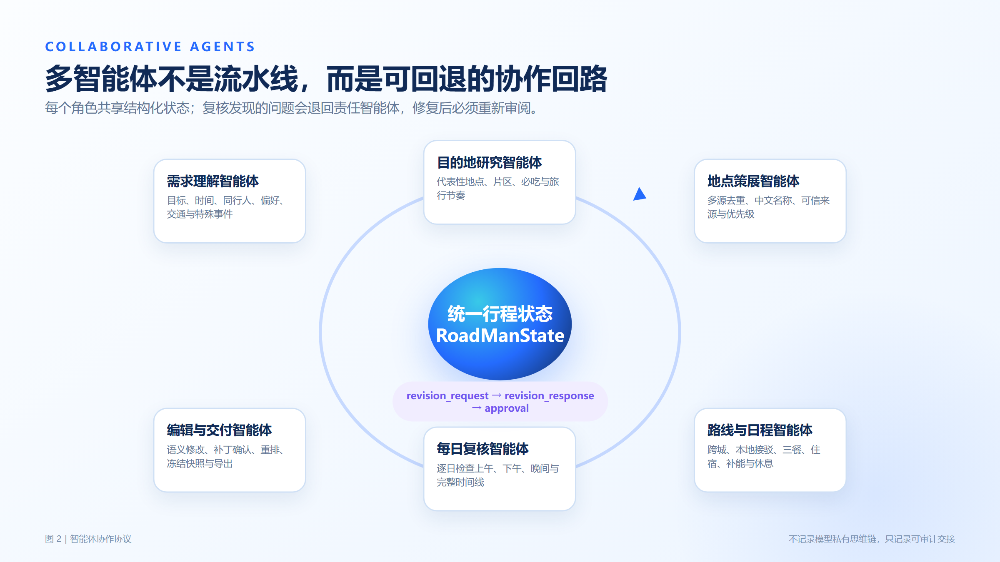
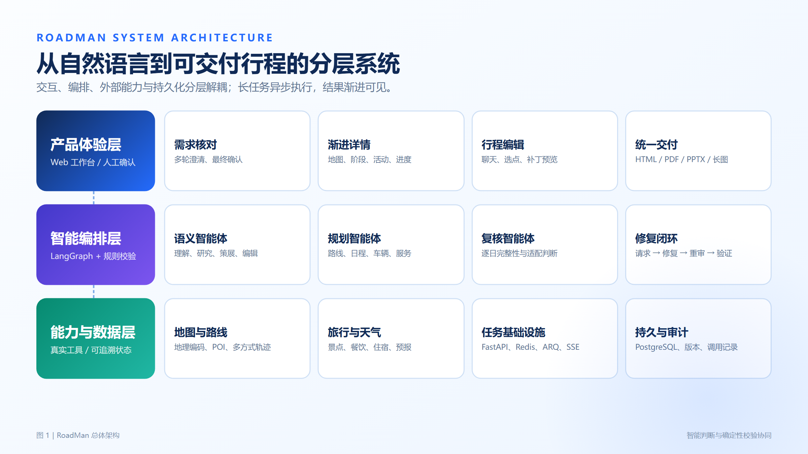
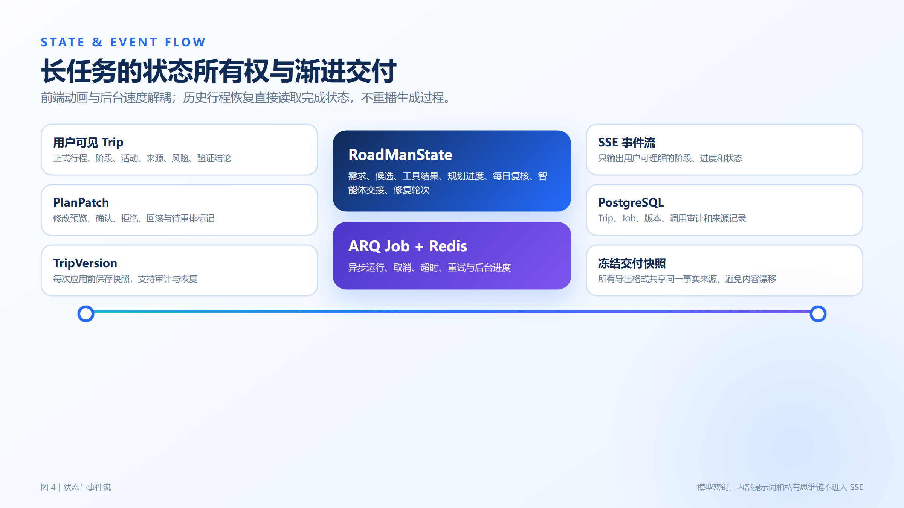
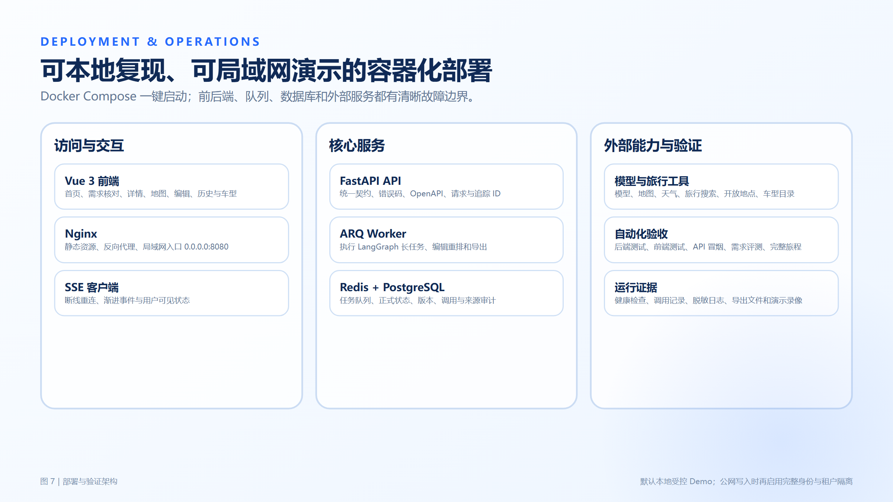
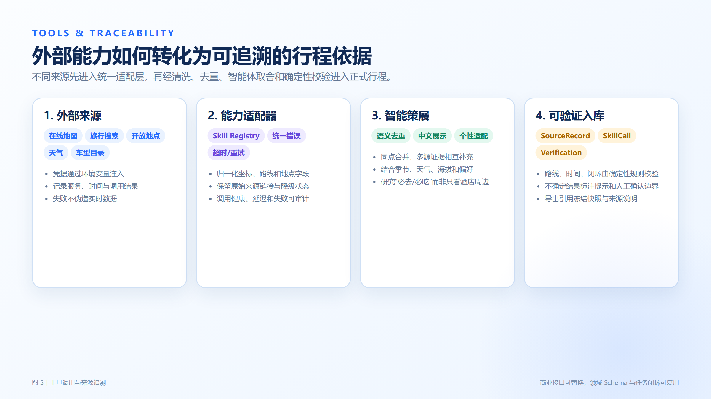
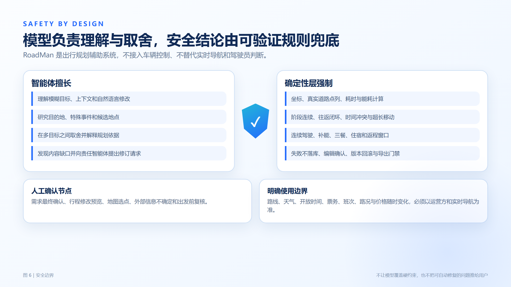

# RoadMan ｜ 多智能体自驾与中短途旅行规划工作台

**GOAI 无界应用 · Boundless Agents · AI+汽车赛题参赛方案**

RoadMan 让智能体完成从"我想去哪"到"可执行、可修改、可验证行程"的完整闭环。

| 提交信息 | 内容 |
| --- | --- |
| 作品类别 | AI+汽车 · 长途及中短途出行规划智能体 |
| 方案文档版本 | V2.0 · 2026-08 |
| 语言 | 简体中文 |


---

# 作品简介（500 字以内）

RoadMan 是面向自驾与中短途旅行的多智能体行程工作台。用户用自然语言说出出发地、目的地、日期、同行人、车辆与偏好，系统完成需求核对、目的地研究、真实路线查询、景点与餐饮住宿策展、逐日时间线编排、驾驶休息与补能安排，并在每日复核与最终校验后交付可执行行程。规划是后台持续执行的长任务：多个智能体按职责协作，路线连续性、时间、三餐、住宿、能耗与返程闭环由确定性规则兜底，复核发现的可修复问题自动重排并再次校验。用户可继续用自然语言或地图选点增删替换行程，先查看修改预览，确认后统一重排路线与时间，再次校验通过后导出 Markdown、HTML、PDF、PPTX 与长图，所有格式共享同一份冻结快照。系统接入高德地图、Open-Meteo 天气、FlyAI 旅行、OpenTripMap 开放地点与车型目录，记录来源、调用时间与降级状态，并以测试集、完整旅程验收与调用审计提供可复现证据。RoadMan 不接入车辆控制，不替代实时导航、运营公告或驾驶员判断；其智能体编排、工具适配、状态模型、复核修复与交付模板可复用于房车、骑行、亲子及新能源长途出行等场景。

> 本方案按 GOAI 无界应用 · Boundless Agents 赛道二参赛手册组织。涉及赛程与最终提交规则，以组委会最新通知为准。

---

# 1. 场景来源、目标用户与核心问题

## 1.1 所选方向

本项目选择赛道二 · Boundless Agents 中的 **AI+汽车** 方向，聚焦"长途及中短途出行规划智能体"。参赛方向鼓励围绕路线、天气、充电与加油、休息点、同行人需求和行程安排形成任务闭环，不要求接入真实车辆控制系统。RoadMan 对应这一边界：做出发前与途中调整的规划辅助，不参与自动驾驶决策或车辆控制。

## 1.2 目标用户

| 用户 | 典型任务 | 现有困难 |
| --- | --- | --- |
| 自驾旅行者 | 2 至 7 天跨城旅行、周末短途、往返闭环 | 地图、攻略、天气、住宿与补能信息分散，靠手工拼接 |
| 新能源车主 | 长途路线、续航、充电、休息与服务区安排 | 可用电量必须进入阶段拆分，不能只画一条线 |
| 情侣、家庭与朋友同行 | 兼顾节奏、餐饮、住宿、兴趣与预算 | 舒适度是软约束，单一最短路无法表达 |
| 活动型旅行者 | 观星、花期、演出、节庆、赛事等时间敏感出行 | 需要先研究事件窗口，再倒排交通与住宿 |
| 混合交通用户 | 自驾不可行或主动选择高铁、飞机、轮渡 | 跨城交通与到达后接驳需形成连续时间线 |

## 1.3 具体痛点

1. 需求天然模糊。用户说"周五晚上出发、情侣舒适一点""暑假去看流星雨"，而不是填完整表单。
2. 信息跨域且持续变化。路线、天气、开放时间、预约、路况、价格、酒店与班次来自不同系统。
3. 行程是耦合系统。换一个景点会影响移动路线、午餐、酒店入住与返程，局部修改不能只改文案。
4. 车辆能力必须参与规划。纯电、燃油、混动的续航、补能、连续驾驶与山路适配各不相同。
5. 好看不等于可执行。凌晨参观、全天空白、三餐缺失、酒店每天更换、超长徒步，在一次性生成里很常见。
6. 用户需要掌控感。系统要解释为何追问、正在做什么、依据来自哪里，并允许确认、撤销与重新规划。

## 1.4 为什么必须使用智能体

这不是固定字段填充或单次推荐问题。系统必须在不完整信息里判断是否追问，按需选择工具，从多源候选中语义去重与取舍，把目标拆成跨城、本地、餐饮、住宿、补能等子任务，发现冲突后决定由哪个角色修复，并在用户修改后恢复上下文继续执行。智能体负责语义理解、研究、取舍与协作；确定性程序负责坐标、路线、时间、能耗、闭环与硬安全规则。两者缺一不可。

---

# 2. 完整任务闭环与产品交互



用户的完整流程是：输入需求 → 需求核对与澄清 → 确认后启动后台规划 → 目的地研究、路线查询、逐日编排、每日复核与自动修复 → 校验通过生成行程 → 用自然语言或地图选点修改 → 预览确认后统一重排并通过校验 → 导出为多种格式。整条链路从"模糊想法"落到"可执行、可修改、可验证"的行程。

## 2.1 任务输入与需求预检

用户输入一段自然语言，也可附加图片、PDF、DOCX、Markdown 或 XLSX 作为上下文。需求理解智能体抽取：

- 出发地、目的地与范围边界；
- 出发与返回日期、时间窗口；
- 同行人数、关系与节奏偏好；
- 允许的交通方式（自驾、火车、飞机、轮渡、公交等）；
- 车辆类型、续航、电量、座位与山路适配；
- 特殊事件、必去或避开地点、饮食与住宿偏好。

只有真正影响执行的信息才进入逐项追问。相对日期、星期结构、显式日期与坐标由确定性层复核，避免模型漏提取导致错误追问。所有条件确认后展示最终确认摘要，用户确认才创建行程并启动后台任务。

## 2.2 研究与工具选择

规划启动后，智能体按任务需要调用工具，而不是固定调用全部。顺序大致为：

1. 先研究目的地代表性景点、片区、必吃与合适节奏；
2. 查询地点坐标与跨城可达性，消解同名地点和范围歧义；
3. 根据自驾可行性与用户允许方式，选择道路、高铁、飞机、轮渡或组合交通；
4. 并行补充景点、餐饮、住宿、服务区、补能点、天气与车辆信息；
5. 对每个候选结合日期、天气、季节、海拔与用户偏好逐项判断适配性，而不是用固定月份黑名单。

## 2.3 渐进规划与详情页

规划在后台由 Redis 与 ARQ 执行 LangGraph 长任务，API 请求不会长时间阻塞。每个工作流节点写入用户可见的进度与阶段结果，SSE 把事件推送到详情页：顶部可视化进度、地图逐段出现路线、阶段卡、活动、酒店、餐饮与右侧智能体协作消息逐项出现。前端动画节奏与后台速度分离，历史完成行程直接恢复，不重播"生成中"动画。

## 2.4 每日复核与自动修复

每天的计划是一条完整时间线，而不是若干 POI 的列表。系统检查：

- 早餐、午餐、晚餐是否齐全且时间合理；
- 非最后一晚是否有住宿，同城连续多日是否优先复用酒店；
- 上午、下午、晚间是否存在不合理空档或过密安排；
- 景点是否重复、是否落在开放与舒适窗口内、是否适应当日天气与用户；
- 活动与移动是否重叠，阶段起终点是否连续；
- 自驾是否安排连续驾驶休息、服务区、加油或充电；
- 超长步行或骑行是否改用合理接驳或拆段；
- 最后是否回到原始出发地或满足用户指定的返程边界。

可自动修复的问题进入最多 4 轮的自动重排与再校验循环：复核发现可修复问题后，重排三餐、停留、接驳与驾驶休息并再次校验，直到通过或达到轮次上限。天气缺失、价格变化等非阻断信息保留为出发前复核提示。只有不可替代的用户选择或真实外部能力完全不可用时，才请求人工处理。

## 2.5 用户修改与补丁编辑

用户可用多种方式调整行程：

- 选中某一天、阶段或活动后说"把这个换成更安静的景点"；
- 说"第二天加一家酒店""在返程服务区吃午饭"；
- 在地图上选一个点，作为景点、住宿或餐饮加入行程；
- 删除活动、替换候选、撤销上次修改或整体改为两天或三天；
- 找不到候选时，让编辑智能体重新搜索并返回可选结果。

系统先展示修改预览（涉及日期、时间变化、目标对象、是否修改正式行程），用户确认后应用，多次局部编辑可累积为待重排状态。编辑智能体把自然语言转成 add、delete、replace、replan 等意图，交由确定性补丁构建器执行。重排完成后需要再次通过校验才能导出；失败不会污染正式行程，已应用的补丁可回滚。

## 2.6 结果交付

校验通过后，用户可查看来源、风险与完整行程，并导出 Markdown、HTML、PDF、PPTX 与长图。导出只使用完成行程的冻结快照；行程未完成或修改后尚未重排时，接口返回明确的门禁错误，避免把旧路线当成新行程。

---

# 3. 多智能体设计




## 3.1 智能体角色与职责

系统内置八类云端智能体，统一接入层输出结构化 JSON，均由确定性程序校验边界。

| 智能体 | 核心输入 | 主要输出 | 不负责的事项 |
| --- | --- | --- | --- |
| 需求抽取（Requirement Agent） | 用户原文、当前日期、历史回答 | 地点、日期、人数、交通、偏好、特殊体验等结构化约束 | 不凭关键词硬编情侣人数或目的地 |
| 需求复核（Requirement Guard） | 已抽取约束、异常与风险 | 必要澄清问题与最终确认摘要 | 不把可自动修复问题推给用户 |
| 目的地研究（Destination Research） | 多源搜索证据、时间预算 | 代表性景点、片区、必吃与旅行节奏 | 不因酒店位置只排附近冷门地点 |
| POI 策展（POI Curator） | 高德与 OpenTripMap 等来源候选 | 同点合并、中文展示名、去重与候选池 | 不直接决定时间线 |
| POI 排序（POI Ranker） | 候选、偏好、特殊体验、日期窗口 | 匹配度评分与排序 | 不凭空创造候选 |
| 适配复核（POI Suitability） | 单个候选、日期、天气、季节、海拔、偏好 | 适合 / 降级 / 排除及理由 | 不用固定月份清单代替逐项判断 |
| 行程编辑（Trip Edit） | 用户消息、选中上下文、候选池 | add / delete / replace / replan 意图与补丁 | 不绕过用户确认直接改正式行程 |
| 特殊事件研究（Event Research） | 命名事件、年份、公开检索摘要 | 峰值窗口、时间、来源与置信度 | 无来源时不臆造日期或时刻 |

## 3.2 工作流节点

主工作流由 LangGraph 编排，按下列顺序执行：

```text
load_context → extract_trip_request → research_events → apply_defaults
→ validate_required_fields ─┬─ 缺信息 → generate_clarification → END
                            └─ 可规划 → build_base_route
→ split_into_days → discover_tourism → build_local_routes → build_stages
→ load_vehicle_profile → discover_services → sample_weather
→ review_tourism_suitability → enrich_deep_drive → schedule_tourism
→ review_daily_schedule → verify_plan
      ├─ 有阻断问题且未达上限 → repair_plan → verify_plan（重新校验）
      └─ 通过 → render_markdown → persist_trip → END
```

这条图不是无条件流水线：需求预检存在条件分支；工具按场景选择；复核可把问题退回修复；修复后必须重新进入每日复核与最终校验。整体调整天数、交通或节奏时，也会把"原始需求加新指令"重新送入完整工作流。

## 3.3 确定性复核与修复循环

每日复核 `review_daily_schedule` 与最终校验 `verify_plan` 是确定性实现：

- `verify_plan` 检查空计划、连续驾驶、路线闭环、旅游计划与返程截止时间，并把阻断项（blocker）与可解释提示（warning）区分开；
- 存在阻断项且未达上限（`MAX_AUTO_REPAIR_ATTEMPTS = 4`）时进入 `repair_plan`，重跑行程编排、每日复核与重叠规整后再回到 `verify_plan`；
- 复核发现的大段自由空档被标注为"自由活动 / 休息时段"而不是伪装成景点，让时间线可解释。

智能体负责语义与取舍，确定性格负责坐标、路线、时间、三餐、住宿、能耗、闭环等硬规则，两者互不越界。

## 3.4 上下文与记忆

- `Trip` 是用户可见的正式行程，整份 JSON 存入持久化文档字段；
- `RoadManState` 是一次图执行中的统一中间状态，包含需求、候选、工具结果、进度、复核与修复轮次；
- `TripVersion` 保存编辑前快照，支持回滚；
- `PlanPatch` 保存一次修改的预览、确认与应用状态；
- 历史行程存入 PostgreSQL，从历史入口恢复时不重新运行规划；
- SSE 只推送可展示状态，不传密钥、内部提示词或模型私有思维链。

---

# 4. 系统架构、状态与部署





## 4.1 技术架构

| 层级 | 主要技术 | 作用 |
| --- | --- | --- |
| Web 产品层 | Vue 3.5、Vite 8、Pinia、Vue Router | 首页、3D 车辆、需求核对、详情、地图、编辑、历史、车型、运维页与导出 |
| 浏览器地图 | 高德 JSAPI 2.0、3D vehicle model-viewer | 地图展示、选点、路线与 3D 车辆模型 |
| API 层 | FastAPI、SQLAlchemy 2.0 async、Alembic、Pydantic | HTTP/SSE 契约、错误码、附件、导出与迁移 |
| 异步任务层 | Redis、ARQ Worker | 长时规划、任务取消、失败恢复与后台进度 |
| 智能编排层 | LangGraph、云端模型客户端 | 条件分支、工具调用、智能体协作、复核与修复循环 |
| 领域与校验层 | Python 领域模型与确定性规则 | 路线连续、时间、闭环、三餐住宿、车辆补能与冲突校验 |
| 持久化层 | PostgreSQL（生产）/ SQLite（本地） | Trip、Job、版本、来源、调用审计与历史 |
| 外部能力层 | Skill Registry 与适配器 | 地图、天气、旅行、开放地点、车型真实数据，统一归一化与降级 |
| 交付层 | HTML 渲染、PDF / PPTX / PNG 生成 | 从冻结快照输出一致报告 |

## 4.2 状态所有权

规划任务可能持续数分钟，因此不能让浏览器请求或单个模型调用拥有全部状态。RoadMan 拆分 canonical Trip、执行状态与任务状态：

- API 创建 Job 后立即返回，Worker 执行完整工作流；
- 每个节点把用户可见产物与进度写入持久状态；
- 浏览器刷新后可继续通过 Trip / Job 状态与 SSE 恢复；
- 删除运行中的行程会取消对应 Job，防止后台继续写入已删除对象；
- 完成行程生成冻结快照，所有导出格式从同一事实来源生成。

## 4.3 部署方式

默认使用 Docker Compose，包含五个服务：

```text
postgres  redis  backend  worker  frontend
```

使用方式：

```powershell
Copy-Item .env.example .env
# 在 .env 中配置模型、地图、旅行与天气凭据
docker compose up -d --build
```

服务启动后：

- Web 工作台：`http://localhost:8080`
- OpenAPI：`http://localhost:8000/docs`
- 统一健康检查：`http://localhost:8080/health`
- 局域网演示：`http://<主机局域网 IP>:8080`

前端端口绑定 `0.0.0.0:8080`，后端只绑定宿主机 `127.0.0.1:8000`，由 Nginx 提供统一入口。备份恢复脚本位于 `deploy/scripts/`。



---

# 5. 工具调用、知识增强与来源追溯



## 5.1 外部能力清单

所有外部能力通过 Skill Registry 与适配器接入，统一记录来源、调用时间、状态与降级信息。

| 能力 | 当前实现用途 | 关键处理 | 失败与边界 |
| --- | --- | --- | --- |
| 高德地图（`amap.*`） | 地理编码、驾车 / 公交路线、交通路况、POI 搜索 | 保留 geometry、来源与调用记录；同名歧义用附近搜索消解 | 不可用时显示可解释简化视图，不把直线冒充真实道路 |
| Open-Meteo 天气（`open_meteo.forecast`） | 计划日期天气与海拔参考 | 记录地点、日期、抓取时间与来源 | 缺失不单独阻断，提示出发前复核 |
| FlyAI（`flyai.*`） | 火车、航班、轮渡、酒店、POI 与关键词 / 语义搜索 | 与地图和开放数据并行，进入统一候选池 | 超时或无结果时不伪造候选，继续使用有来源数据 |
| OpenTripMap（`opentripmap.nearby`） | 补充国际与开放景点数据 | 作为候选，经 POI 策展智能体合并与中文命名 | 必须带来源，遵守服务条款与署名要求 |
| 车型目录（`carinfo.*`） | 搜索车型、续航、能耗、座位等配置 | 搜索结果经用户确认保存，可手动建立车辆 | 目录为空时不阻断，由用户补充数据 |
| 云端大模型 | 需求抽取、复核、研究、策展、排序、适配、编辑与事件研究 | 要求结构化 JSON，不保存私有思维链 | 未配置时关键语义能力明确报错，不声称已做智能判断 |

## 5.2 检索增强策略

RoadMan 采用实时检索而非自建静态向量库，因为路线、天气、酒店、预约与交通信息时效性强。检索流程为：

1. 目的地研究智能体提出搜索意图与范围；
2. 多个来源并行返回候选、摘要、坐标、评分、图片与链接；
3. 标准化字段并用坐标、名称、类别做初步去重；
4. POI 策展智能体判断同一地点、中文展示名与代表性；
5. 适配智能体结合季节、天气、海拔与用户个性逐项判断；
6. 路线工具验证可达性，日程智能体按时间预算取舍；
7. 来源记录与 SkillCall 保存来源、抓取时间、状态与降级信息。

## 5.3 商业服务与替代性

商业 API 与闭源模型可用于比赛，但需披露调用环节、费用假设、权限范围与锁定风险。RoadMan 把外部能力隔离在适配器与 Skill Registry 中，领域模型、工作流与验证规则不依赖具体品牌字段。替换地图或旅行服务时，只需实现相同的 geocode、POI、route、hotel / search 等领域契约；模型也通过结构化输入输出层隔离。

## 5.4 数据最小化

- API Key 只通过 `.env` 或系统环境变量注入，不进 Git、SSE、导出或前端日志；
- Demo 不要求真实姓名、身份证、车牌、家庭地址或订单信息；
- 用户可删除单条行程或清理历史；删除运行中行程会取消后台任务；
- 截图、视频与运行证据提交前必须脱敏；
- 当前为本地受控 Demo，若未来变为公网多用户服务，再实施账号、租户隔离、数据导出与删除请求和隐私告知。

---

# 6. 验证、评测与运行证据

## 6.1 自动化验证体系

RoadMan 提供从单元到端到端的可复现验证，全部以命令和机器可读证据保存：

| 层级 | 覆盖内容 | 入口 |
| --- | --- | --- |
| 后端单元与集成 | API、规划图、编辑、适配器、导出、旅游、每日复核 | `pytest backend/tests` |
| 前端状态测试与构建 | 规划事件去重、渐进显示、类型与生产构建 | `npm run test`、`npm run build` |
| API 冒烟 | 健康、CRUD、外部能力、规划启动、导出门禁 | `deploy/api_smoke.py` |
| 需求理解评测 | 日期、英文、情侣人数、同名地点、跨城、三餐住宿、补能、事件、闭环、跨海、覆盖、季节适配 | `evaluation/run_evals.py` |
| 完整旅程验收 | 新建 → 完成 → 编辑 → 重新校验 → 五格式导出 | `deploy/full_journey_acceptance.py` |
| 编辑重规划验收 | 补丁预览、确认、应用、重排与失败不污染 | `deploy/edit_replan_acceptance.py` |
| 浏览器端到端 | 规划、编辑、运维页的浏览器自动化 | `deploy/showcase_browser_acceptance.mjs` |

## 6.2 需求理解评测集

`evaluation/scenarios.json` 固定了 12 条需求理解场景，输入真实用户说法，核对结构化抽取结果：

| 场景 ID | 验证重点 |
| --- | --- |
| `relative-weekday-zh` | 中文相对星期与往返日期顺序 |
| `relative-date-en` | 英文相对日期与交通约束 |
| `couple-party-size` | 由语义判断人数，不靠字符串分支 |
| `same-name-beijing` | 跨城同名地点消歧，不解析成武汉同名餐馆 |
| `cross-city-multimodal` | 自驾、铁路、飞机等允许方式与时间窗 |
| `daily-meals-lodging` | 多日三餐与住宿完整性 |
| `ev-energy-rest` | 续航、安全余量与连续驾驶 |
| `special-event-perseids` | 事件窗口研究与来源 |
| `route-closure` | 返程回到原始出发地 |
| `cross-sea-ferry` | 跨海轮渡的合理降级 |
| `famous-destination-coverage` | 不被酒店位置绑架，优先代表性地点 |
| `season-weather-personalization` | 对单个活动逐项适配，而非固定黑名单 |

评测结果写入机器可读的 JSON 证据文件，随评审材料一并提供，不以截图代替。

## 6.3 完整旅程与编辑重规划验收

`deploy/full_journey_acceptance.py` 演示"新建 → 完成 → 语义编辑 → 重新校验 → 导出"的完整闭环，校验最终验证、三餐住宿、返程闭环与各格式导出文件签名。`deploy/edit_replan_acceptance.py` 覆盖 10 条 add / delete / replace / replan 编辑场景，确认补丁预览、确认、应用、统一重排以及失败不污染正式行程。这些脚本都输出带日期与命令的证据文件，供评审复现。

## 6.4 运行证据与可复现性

运行证据包含后端测试、API 冒烟、需求评测、完整旅程验收与调用审计，均保留执行日期、Git SHA 与命令，隐藏密钥与个人路径。评审可依据 `docs/` 中的接口契约、领域模型与运维文档，在受限网络或本地环境重建同样的验证流程。路线、天气、开放时间、班次与价格可能随时间变化，运行证据证明的是智能体对任务的理解、工具调用与流程闭环，不替代出发前对官方信息的最终确认。

---

# 7. 安全、合规与使用边界



## 7.1 汽车行业边界

RoadMan 不接入 CAN 总线、车辆控制、自动驾驶或驾驶辅助决策，不在驾驶过程中要求高风险交互。它输出行程规划辅助；真实导航、道路公告、车辆状态、充电设施可用性与驾驶员判断具有最终优先级。

## 7.2 不确定信息

路线、天气、开放时间、预约、票务、班次、路况与价格会变化。系统记录来源、获取时间与降级状态，并在详情与导出中提示出发前复核。真实道路 geometry 不可用时不伪造轨迹；外部服务无结果时不生成虚构地点或班次。

## 7.3 数据与隐私

当前 Demo 使用用户自愿输入、公开或授权第三方服务、公开数据与项目生成的行程状态。默认不采集身份证、车牌、支付、精确家庭住址等敏感信息。凭据写入本地环境变量；提交截图、日志与视频前脱敏。未来若承载真实订单、位置历史或车辆数据，将补充隐私告知、授权撤回、数据保留期限、访问控制与数据主体请求流程。

## 7.4 知识产权与第三方依赖

代码依赖与商业服务需在最终仓库中披露版本、许可证或服务条款、调用范围与替代方案。景点摘要、网页图片与地图底图遵守来源平台的展示、缓存与署名规则；无明确可再利用权限的图片不进入公开提交包。本文两张主视觉由生成式图像工具制作，无第三方商标；精确中文架构图由 `tools/diagrams.html` 与 `tools/render_diagrams.mjs` 代码生成。

## 7.5 模型与结果安全

模型输出必须通过结构化 Schema、坐标与路线工具以及确定性验证。SSE 与数据库不保存模型私有思维链，只保存结构化决策、公开理由、问题码与协作状态。模型不能覆盖硬路线、时间、闭环与车辆安全结论。

---

# 8. 开放复用价值与落地计划

## 8.1 可复用资产

| 资产 | 复用方式 |
| --- | --- |
| 语义智能体 + 确定性校验双层设计 | 可用于其他需要"可执行、可验证结果"的长任务计划 |
| Skill Adapter 与 Skill Registry | 地图、天气、搜索、车型能力可更换服务商而不改变领域流程 |
| 行程领域 Schema | Trip、DayPlan、Stage、Activity、Source、Verification 可用于房车、骑行、亲子和研学 |
| 补丁式两阶段编辑 | 适用于"自然语言修改正式业务计划"的预览、确认、重算与回滚 |
| 完整旅程验收 | 可作为智能体项目"新建 → 执行 → 修改 → 验证 → 导出"的端到端测试模板 |
| 多格式交付模板 | 同一冻结快照生成 Web、PDF、PPTX 与长图，减少事实漂移 |

最终开源范围与许可证由团队在提交前确认。若仓库暂不完全公开，应提供评审可访问链接、运行镜像或压缩包，并说明第三方依赖与团队原创贡献。

## 8.2 落地路线

**初赛阶段**

- 提交本方案 PDF、500 字作品简介与主 Demo 视频；
- 提供可访问仓库、README、环境变量模板与运行证据；
- 固化一条稳定主 Demo 与一条异常分支。

**复赛阶段**

- 扩充分层评测集、规划质量统计与视觉回归；
- 增强路线、预约、酒店与餐饮可用性和跨城交通的真实服务覆盖；
- 完善移动端、弱网恢复、可访问性与运行监控；
- 明确第三方数据授权、图片缓存与公开导出策略。

**决赛与产品化**

- 车机 / 移动端轻量入口与语音交互；
- 基于授权的车辆剩余续航、充电偏好与日历上下文；
- 同伴协作、费用预算、预订跳转与出发前动态复核；
- 多租户身份、审计、配额、SLA 与隐私治理。

---

# 9. 赛道评审维度对照

| 评审维度 | 权重 | RoadMan 对应证据 | 演示重点 |
| --- | ---: | --- | --- |
| 行业场景价值 | 25% | AI+汽车长途及中短途出行；路线、车辆、补能、休息、三餐住宿完整链路 | 用一条真实多日自驾需求展示手工拼接痛点 |
| Agent 能力与闭环 | 25% | 需求理解、多轮确认、研究、工具调用、复核修复、编辑重排与交付 | 展示"发现 → 修复 → 重审"而非只看最终地图 |
| 产品体验与 Demo | 20% | 渐进详情、地图卡片、聊天 / 选点、历史、版本、导出 | 连续演示，一次修改贯穿前后 |
| 技术实现深度 | 15% | LangGraph、FastAPI、Redis / ARQ、PostgreSQL、SSE、Skill Registry、确定性校验 | 用架构图与调用记录解释状态流转 |
| 安全、合规、可追溯 | 10% | 数据来源、调用审计、人工确认、失败不伪造、不接车辆控制 | 展示来源、风险与外部服务失败分支 |
| 开放 / 复用贡献 | 5% | 适配器、Schema、补丁编辑、验收脚本与导出模板 | 说明如何迁移到房车、骑行或亲子场景 |

---

# 10. 竞争优势与应用价值

## 10.1 相对普通攻略生成

普通攻略工具通常一次生成文本，无法证明路线真实、时间连续、三餐住宿完整，也难以在用户修改后重算。RoadMan 把"内容建议"放进可执行工作流，以真实工具、持久状态、复核修复与人工确认形成闭环。

## 10.2 相对地图导航

地图擅长点到点路线，但不负责理解"情侣舒适""每天不要换酒店""想看流星雨"等跨日目标，也不自动完成景点组合、三餐住宿与多轮编辑。RoadMan 以地图为工具，不试图替代实时导航，负责更上层的旅行任务编排。

## 10.3 用户价值

- 减少在攻略、地图、天气、酒店与车辆信息间反复切换；
- 提前发现缺餐、超长步行、阶段断裂、补能不足与返程不闭环；
- 让同行人看到结构化、可分享的共同计划；
- 修改一个地点后自动重算关联路线与时间，降低手工维护成本；
- 保留来源、版本与风险，提升对 AI 结果的信任与掌控感。

## 10.4 行业价值

RoadMan 展示了汽车服务智能体不必控制车辆，也能在车主生命周期中创造高频价值：车型与能源上下文进入规划，地图、天气、文旅、住宿、餐饮与补能服务通过标准工具链被组织起来。该能力可向车企 App、车机生态、地图服务、文旅平台、租车与新能源服务扩展。

---

# 11. 团队信息与分工

| 姓名 | 角色 | 负责内容 | 联系方式 |
| --- | --- | --- | --- |
| 成员一 | 产品 / Agent / 后端 | 需求理解、规划图、工具适配与校验 | 由团队填写 |
| 成员二 | 前端 / 视觉 / 演示 | Vue 工作台、地图、3D 车辆、导出与运维页 | 由团队填写 |
| 成员三 | 行业研究 / 路演 | 赛道分析、评测、Demo 与评审材料 | 由团队填写 |

**团队原创贡献说明：** 项目定位为多智能体行程规划工作台，围绕"语义智能体 + 确定性校验"双层设计、补丁式编辑、统一冻结快照交付与端到端验收体系开展，所用开源与商业组件及其许可证在提交时按组委会规则披露。

---

# 附录 A：Agent 应用能力清单

| 能力项 | RoadMan 实现 |
| --- | --- |
| 应用入口 | Web 首页自然语言输入、附件、历史、车型；详情页聊天与地图选点 |
| 任务输入 | 地点、日期、同行人、偏好、车辆、交通、特殊体验与用户修改 |
| 意图理解 | 云端语义智能体输出结构化 JSON，确定性日期与坐标校验补强 |
| 任务规划 | LangGraph 条件图拆分研究、路线、日程、服务、复核、修复与交付 |
| 工具调用 | 高德、Open-Meteo、FlyAI、OpenTripMap、车型目录与文件 / 图片理解 |
| 知识增强 | 多源实时检索、来源归一、智能策展、特殊事件研究与适配判断 |
| 上下文管理 | RoadManState、canonical Trip、Job、版本、补丁、历史与 SSE |
| 多轮交互 | 规划前逐题澄清；规划后语义编辑、候选搜索、预览确认与回滚 |
| 结果交付 | 地图、阶段、活动、来源、风险、Markdown / HTML / PDF / PPTX / PNG |
| 失败处理 | 结构化错误、非阻断降级、自动修复、失败不落库、导出门禁 |
| 安全边界 | 不接车辆控制；硬路线 / 时间 / 能耗由规则验证；用户最终确认 |
| 运行证据 | 单元与集成测试、API 冒烟、需求评测、完整旅程、导出文件与调用审计 |

---

# 附录 B：运行与复现

## B.1 关键环境变量

| 变量 | 用途 | 提交注意 |
| --- | --- | --- |
| `OLLAMA_API_KEY` | 云端需求、研究、复核、编辑等智能体 | 只在本地 `.env` 配置，不提交 |
| `OLLAMA_MODEL` | 默认模型标识 | 默认 `deepseek-v4-flash:0731-cloud` |
| `AMAP_WEBSERVICE_KEY` | 地理编码、POI 与路线 | 不出现在前端截图和日志 |
| `VITE_AMAP_JSAPI_KEY` | 浏览器地图 | 按平台配置域名白名单 |
| `VITE_AMAP_SECURITY_JS_CODE` | 浏览器地图安全配置 | 不写入公开文档实际值 |
| `FLYAI_API_KEY` | 旅行、酒店、餐饮与交通候选 | 商业服务条款与额度需披露 |
| `OPENTRIPMAP_API_KEY` | 开放地点补充 | 可选，保留来源与署名 |

## B.2 验证命令

```powershell
$env:PYTHONPATH = 'backend'
pytest backend/tests -q

cd frontend
npm run test
npm run build

cd ..
python deploy/api_smoke.py
python evaluation/run_evals.py
python deploy/full_journey_acceptance.py --keep-trip
python deploy/edit_replan_acceptance.py
```

## B.3 评审材料建议目录

```text
RoadMan/
├─ README.md                  # 安装、配置、启动与验证
├─ project.md                 # 架构、流程、文件职责与边界
├─ docs/                      # 接口契约、领域模型与运维
├─ deploy/                    # Compose、Nginx、冒烟与完整验收
├─ evaluation/                # 固定评测