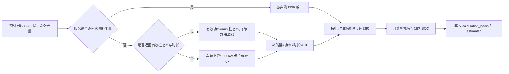

# 优化方向一：续航能力真实化与可量化

## 1. 评委意见与本轮结论

评委指出两个关键问题：补能后 SOC 不能固定重置为某个百分比；续航能力需要以“预测值 vs. 观测值”量化，而不能只展示规划动画。

本轮已经完成以下工程闭环：

- SOC 沿阶段连续传播，补能前、补能量、补能后、后续消耗和到达 SOC 都有独立字段。
- 真实补能量存在时优先采用 `actual_energy_added_kwh` / `actual_fuel_added_liters`。
- 没有实测补能量时，以充电桩功率、车辆最大受电功率、计划时长和充电效率计算，不再写死 80%。
- 服务未返回功率时使用保守公共快充功率，并附加 `CHARGING_POWER_ESTIMATED`，对用户公开估算依据。
- 对超量上报、负数、零功率、无效字符串、SOC 超过 100%、电池参数异常等输入做归一化或降级，不让异常元数据打崩规划线程。
- 建立 12 条模拟传感器回放的误差评测，并提供严格的 `--require-real` 开关，避免把模拟数据包装成实车数据。


> 图 1：由 `evaluation/results/*.json` 自动生成，原始画布 2560×1440。当前数据类型明确为模拟传感器回放。

## 2. 连续 SOC 计算模型

### 2.1 行驶消耗

纯电车型单阶段预测能耗为：

```text
E_use = distance_km × consumption_kWh_per_100km / 100 × route_factor
SOC_used = E_use / battery_kWh × 100
```

当前 `route_factor` 只在路线工具返回累计爬升达到阈值时使用 1.12；系统不再从地点名称中的“山”“峰”等字符猜测地形。燃油车按额定续航和实际油耗计算百分比消耗，避免把燃油车强行套用充电模型。

### 2.2 补能位置与阶段连续性

补能点在路线中的位置由真实路线 geometry 与补能点坐标的最近索引确定。若补能点缺少坐标，则保守按阶段中点估算并公开不确定性。

```text
SOC_before = clamp(SOC_start - SOC_used_before_stop, 0, 100)
SOC_after  = clamp(SOC_before + energy_added / battery_kWh × 100, 0, 100)
SOC_arrive = clamp(SOC_after - SOC_used_after_stop, 0, 100)
next_stage.SOC_start = current_stage.SOC_arrive
```

长途阶段被拆成多个驾驶/休息段后，拆分前后的能耗总量守恒；只有实际发生补能的边界携带补能字段，后一段的起始 SOC 必须等于前一段的剩余 SOC。

### 2.3 补能量计算优先级



三种计算依据分别是：

| `calculation_basis` | 依据 | 是否估算 |
|---|---|---:|
| `measured_energy` | 服务或车辆记录返回的实际 kWh/L | 否 |
| `charger_power` | 桩功率、车辆受电上限与时长 | 是 |
| `conservative_fallback` | 功率缺失，使用不超过 60kW 的保守值 | 是 |
| `fuel_service_estimate` | 燃油服务点存在但加油量未知 | 是 |

## 3. 奇怪案例与边界测试

本轮新增并自动化验证以下案例：

| 案例 | 输入异常 | 期望行为 |
|---|---|---|
| 超量补能上报 | 服务声称一次补入 500kWh | 按电池剩余空间封顶，SOC 不超过 100% |
| 超充功率大于车辆上限 | 桩 350kW、车辆只支持 90kW | 有效功率为 90kW |
| 充电元数据畸形 | 功率 0、补能量 -30、时长字符串非法 | 忽略坏值，使用 60kW 保守估算并告警 |
| 燃油车实测加油 | 返回 18L | 按油箱容量和 18L 更新剩余百分比，不固定重置 |
| 车辆 SOC 越界 | 当前电量 180% | 限制为 100%，附加数据归一化告警 |
| 电池/能耗非法 | 电池 -1kWh、能耗 0 | 使用保守默认值，规划继续且公开降级 |
| 多段长途驾驶 | 阶段被拆成多个休息段 | 每段 SOC 首尾连续、总消耗守恒 |
| 补能服务中断 | 无真实桩候选 | 插入路线估算检查点，但标记不可直接执行 |

相关测试位于 `backend/tests/test_deep_drive.py` 和 `evaluation/test_safety_scenarios.py`。专项回归当前为 22/22 通过。

## 4. “预测值 vs. 观测值”指标

当前 12 条回放覆盖常温平路、高速、城市低速、山路、低温、高温、降水、拥堵、满载、下坡回收与长途混合路况。

| 指标 | 当前结果 | 基线阈值 | 结论 |
|---|---:|---:|---|
| 能耗 MAPE | 8.442% | ≤ 12% | 通过 |
| 能耗 MAE | 2.295kWh | 信息项 | — |
| 能耗 RMSE | 2.605kWh | 信息项 | — |
| 能耗偏差 | -1.962kWh | 信息项 | 模型总体偏乐观，需要继续校准 |
| 能耗 P95 绝对百分比误差 | 15.707% | 信息项 | 识别尾部风险 |
| 等效续航 MAPE | 9.302% | ≤ 12% | 通过 |
| 到达 SOC MAE | 2.799pp | ≤ 5pp | 通过 |
| 到达 SOC P95 误差 | 5.287pp | 信息项 | 用于安全余量设计 |

低温样本是当前误差最大的单项之一，说明固定基础能耗仍不足以覆盖电池温度、热管理与空调负荷。复赛展示时应把这一点作为后续实车校准目标，而不是隐藏。

## 5. 真实道路采集方案

当前仓库没有可被审计的真实车辆遥测集，因此不能宣称已经完成实测。建议在复赛前采集至少 30 个有效路段，并按以下协议替换 JSON：

1. 记录车型、电池可用容量、出发/到达 SOC、里程、平均速度、温度、降水、载荷、累计爬升、空调状态和实际补能量。
2. 单个路段尽量避免途中补能；若补能，必须拆成前后两个路段并记录桩侧实际电量。
3. 仪表 SOC 在静置后读取；同一车型至少覆盖常温、低温、高速、拥堵和山路。
4. 不采集车牌、VIN、精确家庭地址或乘员身份；起终点坐标在导出评测集前做网格化或删除。
5. 将 `data_kind` 明确设为 `real_vehicle_telemetry`，保留采集日期、仪表来源和脱敏说明。
6. 使用留出法：校准集与评测集按路线/日期分离，禁止用全部样本调参后再报告同一批误差。

真实数据审核命令：

```powershell
python evaluation/range_accuracy.py `
  --input evaluation/range_observations.real.local.json `
  --output evaluation/results/range-accuracy-real.json `
  --require-real
```

若输入仍是模拟回放，命令返回退出码 2 并显示 `REFUSED`。

## 6. 演示建议

1. 打开一条长途纯电行程，展示阶段卡中的起始 SOC、补能量、补能时长和到达 SOC。
2. 展示一个桩功率缺失案例，强调系统继续规划但给出黄色估算告警。
3. 运行 `python evaluation/range_accuracy.py`，再打开指标看板。
4. 明确说出“当前 12 条是模拟传感器回放，真实道路数据正在按相同结构采集”。

这套表达同时回应了“能力可量化”和“诚实边界”两项评委意见。

