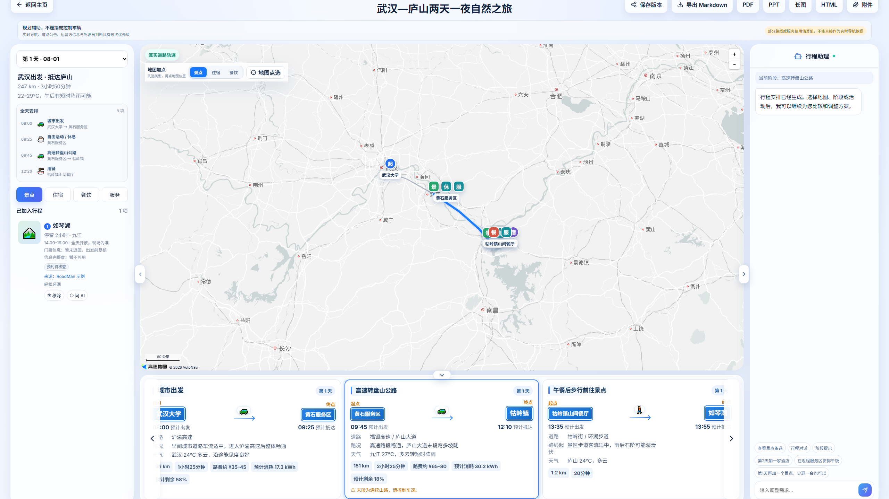
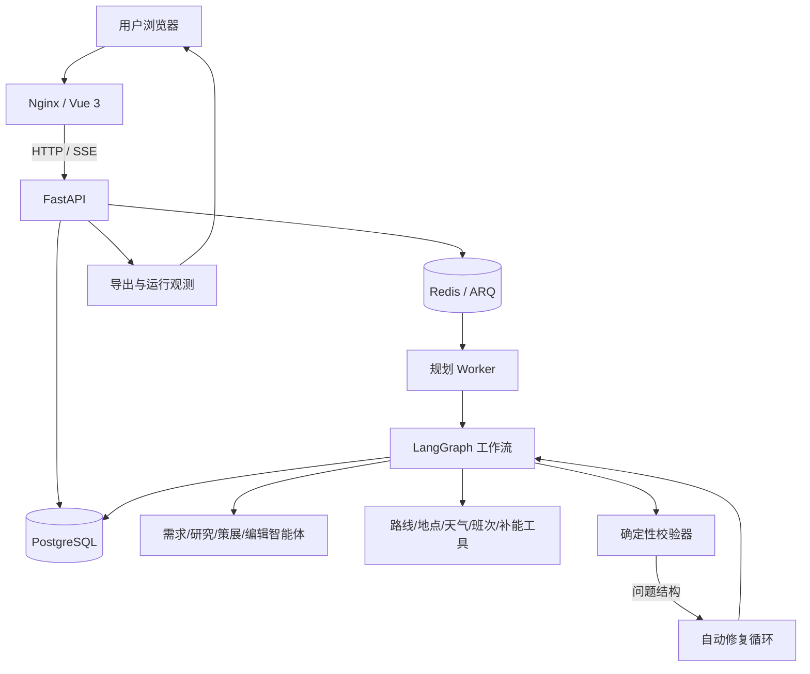
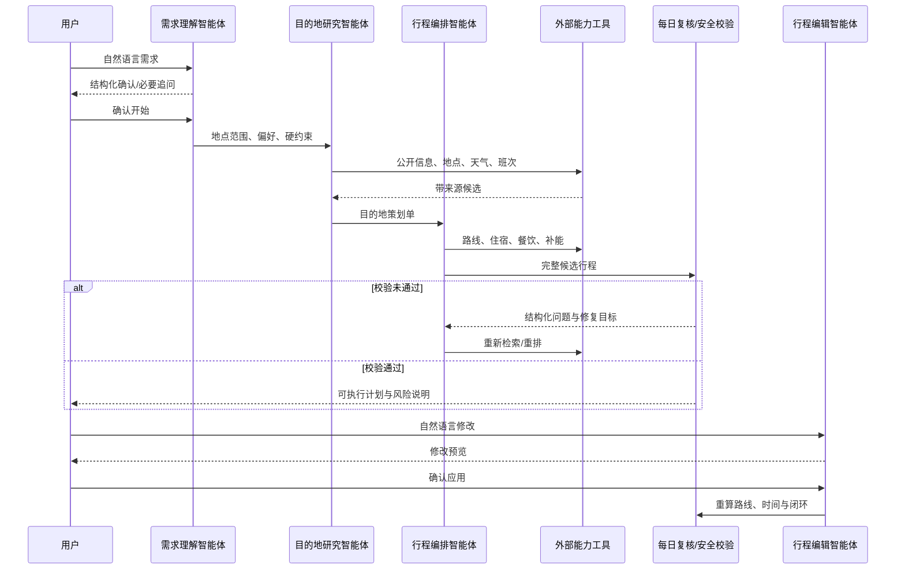
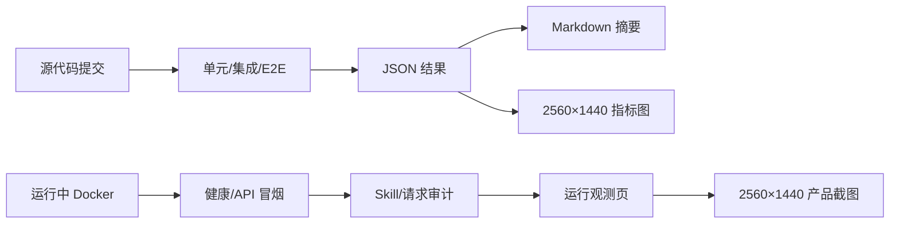
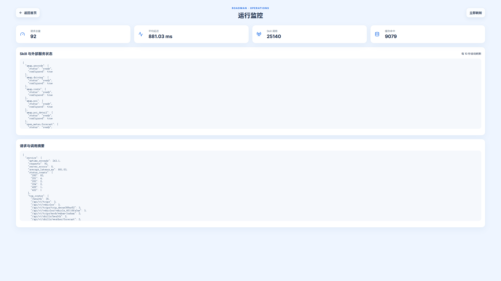
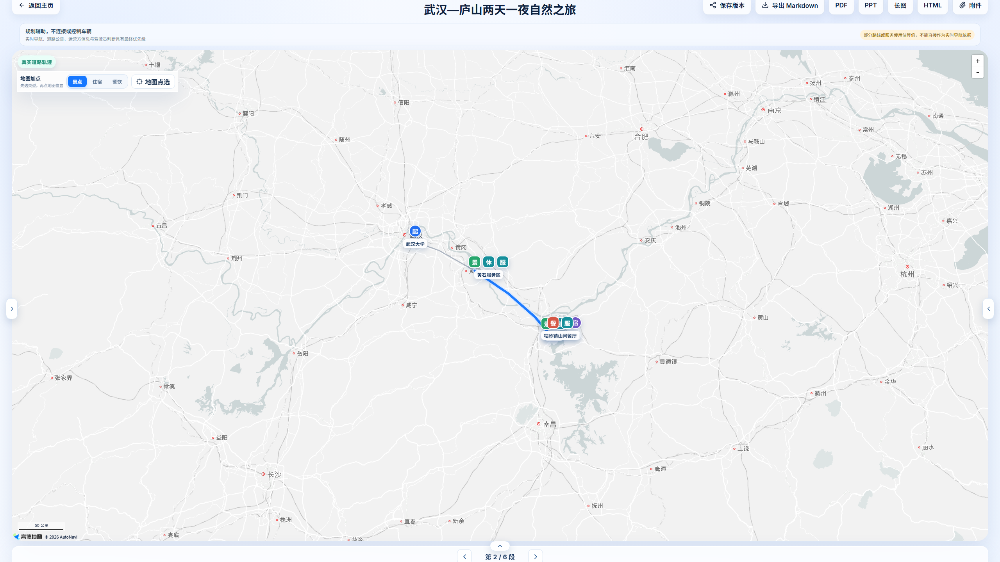

# 优化方向二：可复现 Demo 与技术细节完善

## 1. 目标

复赛材料不能只依赖剪辑视频。评委应当能够从代码仓库完成以下验证：

1. 启动五个服务并打开统一 Web 入口。
2. 看到需求理解、异步规划、工具调用、自动复核、编辑确认、重新计算和导出闭环。
3. 在无外部凭据或某个服务中断时，仍得到可解释的降级结果。
4. 用同一套命令重跑后端测试、续航误差、异常矩阵、前端单测和生产构建。
5. 从机器可读 JSON 追溯到截图、指标与源测试。



> 图 1：完整规划页，原始截图 2560×1440。左侧日程、中间地图与阶段、右侧行程助理来自同一 Trip 快照。

## 2. 可复现系统架构



Compose 服务与职责：

| 服务 | 作用 | 可验证点 |
|---|---|---|
| `frontend` | Vue 3 + Nginx 统一入口 | 首页、规划页、地图、SSE、导出、观测页 |
| `backend` | FastAPI、接口、持久化、导出 | `/health`、OpenAPI、行程/车型/Skill API |
| `worker` | ARQ 异步任务、LangGraph | 规划不阻塞 HTTP，进度写入 Redis/数据库 |
| `postgres` | 行程、消息、版本、审计元数据 | 重启后状态保留，删除时级联清理 |
| `redis` | 队列、事件与临时状态 | Worker 消费和 SSE 进度 |

## 3. 多智能体协作细节

RoadMan 不是单轮 Prompt 生成器。规划主链包括需求理解、目的地研究、目的地策划、地点候选、适配判断、路线、天气、住宿/餐饮/补能、每日复核、自动修复与持久化。需求智能体会先裁决同一句话中的行政区父级与明确子城市，规划任务重新提取出更具体地点时同步刷新路线锚点，不沿用旧坐标。模型负责语义理解和取舍；坐标、时间、能耗、连续性与安全边界由工具和确定性校验器负责。



地点进入路线前先合并同一景区的入口、停车场和游客中心等 provider 变体，再按用户必去、研究证据、适配评分与相邻转场距离选择；只有当日路线实际经过的候选才写成活动卡。住宿基点按目的地与代表性景点的典型距离选择并尽量跨日复用，每天在晚间截止前回到酒店；返程时间不足时先删减可选游览，不跳过酒店接驳，同地酒店/返程锚点不产生零时长阶段。修复循环有次数上限，且不会用模型文本覆盖硬安全结论。失败时保留原版本，不把半成品覆盖为正式行程。


## 4. 三档复现入口

### 4.1 最短启动路径

```powershell
Copy-Item .env.example .env
# 本地填写必要 API Key；不要提交 .env
docker compose up -d --build --wait
docker compose ps
Invoke-RestMethod http://127.0.0.1:8080/health
```

浏览器打开 `http://127.0.0.1:8080/home`。局域网演示使用 `http://<宿主机局域网IP>:8080`。

### 4.2 一键离线/确定性复赛检查

```powershell
.\deploy\semifinal-check.ps1
```

该脚本执行：

- 构建 backend、worker、frontend 镜像；
- 在一致的后端镜像依赖中运行全部后端测试；
- 运行续航和 12 个异常降级评测；
- 生成 `semifinal-readiness.json/.md`；
- 运行前端单测和生产构建。

### 4.3 运行中容器验收

```powershell
.\deploy\semifinal-check.ps1 -Live
python deploy/api_smoke.py
python deploy/full_journey_acceptance.py
python deploy/edit_replan_acceptance.py
```

`api_smoke.py` 检查健康、外部能力、行程/车辆增删改、附件、任务队列及五种导出；完整旅程脚本会真正等待规划完成并执行一次语义编辑与重新验证。

## 5. 证据与追溯关系



每张新截图都记录在 `assets/screenshot-manifest.json`，包含画布尺寸和来源 URL。指标图不是手工填写数字，而是读取评测 JSON 生成。



> 图 2：运行观测页，原始截图 2560×1440。用于展示请求、工具、错误码、延迟与调用成功情况，不显示 API Key 或模型私有思维链。

## 6. 降级可复现性

不配置 provider 不是“页面报错结束”，而是进入明确状态：

| 缺失能力 | 可继续内容 | 不允许伪造的内容 |
|---|---|---|
| 天气 | 基础风险与通用建议 | 逐时温度、降水概率 |
| 充电桩 | 路线估算检查位置 | 真实营业桩、空闲枪数量 |
| 充电功率 | 60kW 保守估算 | 服务未返回的准确功率 |
| 班次 | 保留交通偏好、提示复核 | 虚构车次/航班号 |
| 地图 geometry | 带说明的示意连线 | 导航级真实道路轨迹 |
| 语义模型 | 暂停需要语义判断的步骤 | 用关键词猜地点并冒充智能体理解 |

## 7. 在线 Demo 与本地复现的关系

团队已独立开放受控公网 Demo，访问地址与必要说明由参赛入口提供，本仓库不重复登记公网域名或账号。评委既可以直接体验公网入口，也可以按本页命令从同一代码和配置模板启动五服务环境；两条路径共享相同的 Trip、Skill、校验、降级与导出契约，截图只作界面证据，不是唯一复现方式。

受控公网 Demo 不等于生产级多租户服务。从演示环境升级为正式商业服务仍需持续核对 HTTPS、账号与资源级鉴权、租户隔离、密钥托管、限流/WAF、备份恢复、隐私告知和第三方授权；数据库、Redis 与后端管理接口不得直接暴露到公网。

## 8. 复赛 Demo 建议顺序

1. 首页输入自然语言需求并确认结构化理解。
2. 展示 SSE 渐进规划：等待层用需求扫描、地点搜索、候选筛选与多智能体协作等单一焦点场景呈现，进入工作台后再核对真实节点进度。
3. 进入行程页，展示地图、阶段、日程、来源和风险。
4. 收起左、右、底部栏，展示地图聚焦态。
5. 用自然语言提出修改，先看预览，再确认重排。
6. 展示一次服务中断降级。
7. 导出 PDF/PPT/HTML，并打开运行观测页与评测报告。



> 图 3：左右栏和底部详情已收起，只保留两侧展开箭头和底部简化阶段切换，原始截图 2560×1440。
