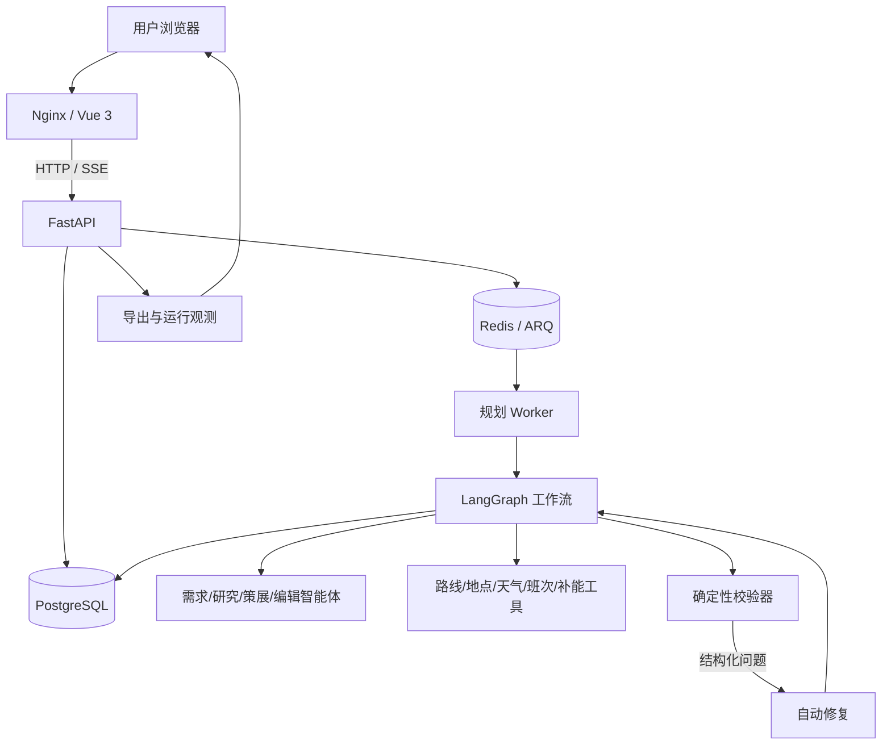
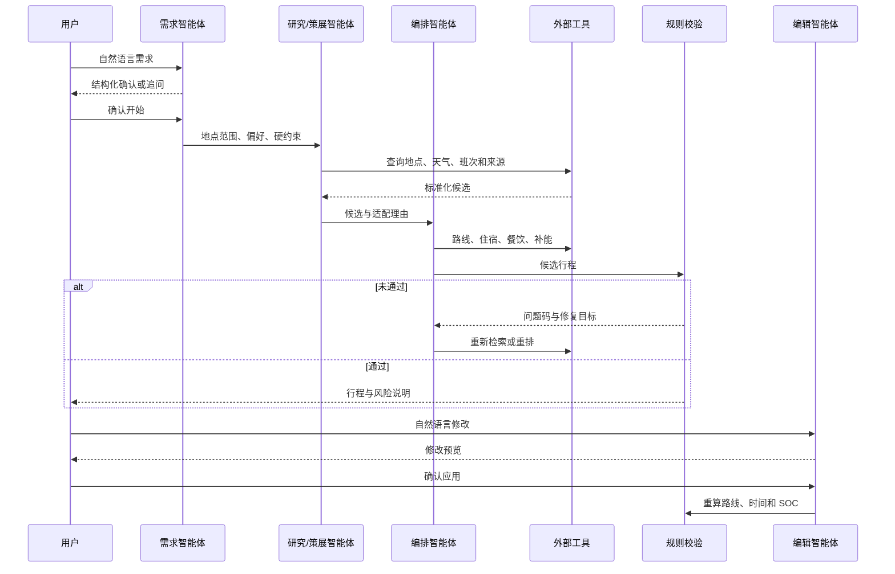
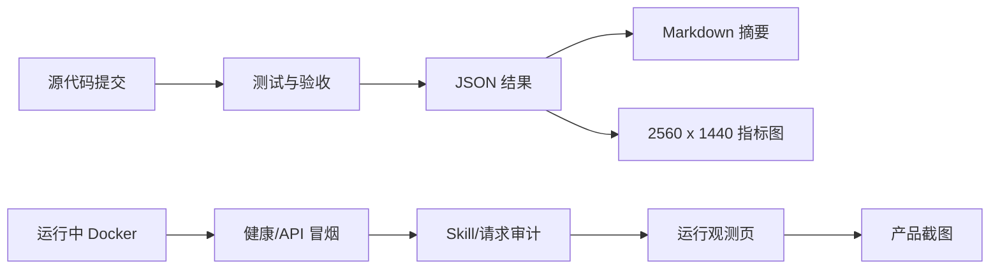

# 优化方向二：可复现 Demo 与技术细节完善

## 1. 评委如何复现

团队已经开放受控公网 Demo，访问方式由参赛入口提供。仓库还提供本地五服务版本，评委可以检查以下内容：

1. 从一句自然语言需求开始，经过确认、后台规划、复核和导出得到完整行程。
2. 查看智能体调用的外部工具、来源、耗时、缓存和错误状态。
3. 修改已完成行程，核对预览、确认、重排和失败回滚。
4. 断开一个外部服务，观察系统是否给出明确的降级状态。
5. 用固定命令重跑后端测试、续航误差、安全场景、前端单测和生产构建。


> 图 1：左侧日程、中间地图与阶段、右侧行程助理读取同一个 Trip 快照。原始截图为 2560 x 1440。

## 2. 运行架构



| 服务 | 用途 | 可检查内容 |
|---|---|---|
| `frontend` | Vue 3 与 Nginx 统一入口 | 首页、规划页、地图、SSE、导出、运行观测 |
| `backend` | FastAPI、接口、持久化、导出 | `/health`、OpenAPI、行程、车型和 Skill API |
| `worker` | ARQ 后台任务与 LangGraph | 长时间规划不占用 HTTP 请求，进度写入 Redis 和数据库 |
| `postgres` | 正式行程、消息、版本、审计元数据 | 重启后恢复，删除行程时级联清理 |
| `redis` | 队列、事件和临时状态 | Worker 消费任务，SSE 读取进度 |

## 3. 智能体与确定性程序各做什么

需求智能体处理口语日期、同行关系、偏好和必达点，信息不足时生成最少量的追问。目的地研究与策展智能体整理候选、来源和适配理由。编辑智能体把用户的自然语言修改转成结构化补丁。

坐标、路线、时间、三餐、住宿、连续驾驶、SOC 和返程由工具与规则校验。模型不能覆盖这些硬检查。发现可修复问题时，校验器返回问题码和目标，规划器重新检索或重排；达到次数上限仍未通过时停止交付。失败的修改也不会覆盖原行程。



地点入选前会合并同一景区的入口、停车场和游客中心等变体，并过滤道路、旅行社、企业和服务设施。名称或来源类别不明确的候选交给排序与适配智能体复核；用户明确指定的地点保留，但会显示实体分类结果。住宿按目的地和代表性景点选择基点，尽量跨日复用。返程时间不足时先删减可选游览，不能跳过酒店接驳。

## 4. 三种复现方式

### 4.1 本地快速启动

```powershell
Copy-Item .env.example .env
# 在本地填写必要 API Key
docker compose up -d --build --wait
docker compose ps
Invoke-RestMethod http://127.0.0.1:8080/health
```

浏览器打开 `http://127.0.0.1:8080/home`。局域网演示地址为 `http://<宿主机局域网IP>:8080`。

### 4.2 固定复赛检查

```powershell
.\deploy\semifinal-check.ps1
```

脚本会构建 backend、worker 和 frontend 镜像，在一致的容器依赖中运行后端测试，随后执行续航和 12 个异常场景评测、生成复赛摘要，再运行前端单测和生产构建。

### 4.3 运行中验收

```powershell
.\deploy\semifinal-check.ps1 -Live
python deploy/api_smoke.py
python deploy/full_journey_acceptance.py
python deploy/edit_replan_acceptance.py
```

`api_smoke.py` 检查健康状态、外部能力、行程与车辆增删改、附件、任务队列和五种导出。完整旅程脚本会等待真实规划完成，再执行语义编辑与重新校验。

## 5. 结果如何追溯



`assets/screenshot-manifest.json` 记录每张截图的画布尺寸、来源页面和生成时间。指标图读取评测 JSON，不手工录入数值。


> 图 2：运行观测页显示请求、工具、错误码、延迟与调用结果，不显示 API Key 或模型私有思维链。

## 6. 可重复的降级检查

| 缺失能力 | 系统仍可提供 | 系统不会声称 |
|---|---|---|
| 单个首页天气源 | 从其他可用源选择当前天气，并保留各源状态 | 所有来源都已成功 |
| 四个首页天气源全部失败 | 天气卡显示不可用；行程保留基础风险提示 | 逐时温度或降水概率 |
| 充电桩 | 路线上的估算检查位置 | 真实营业桩或空闲枪数 |
| 充电功率 | 不超过车辆上限的 60kW 保守估算 | 服务没有返回的准确功率 |
| 班次 | 保留交通偏好并要求复核 | 虚构车次或航班号 |
| 地图 geometry | 带说明的示意连线 | 导航级道路轨迹 |
| 语义模型 | 暂停需要语义判断的步骤 | 用关键词猜地点并冒充模型理解 |

首页当前并发查询 Open-Meteo、wttr.in、MET Norway 和 7Timer。多个可用来源温差达到 8 摄氏度时，页面提示出发前复核。路线规划的逐时天气仍由 Open-Meteo 提供，并与路线时刻、海拔和景点适配规则一起使用。

## 7. 公网 Demo 的范围

公网入口与本地版本使用相同的 Trip、Skill、校验、降级和导出契约。公网可访问只能说明评委可以直接体验当前版本；正式多人服务仍需补足账号与资源级鉴权、租户隔离、密钥托管、限流、WAF、备份恢复、隐私告知和第三方授权。PostgreSQL、Redis 和后端管理接口不能直接暴露到公网。

## 8. 建议现场顺序

1. 从首页创建行程并确认系统对需求的理解。
2. 在详情页查看地图、阶段、日程、来源和风险。
3. 收起两侧和底部面板，核对路线与活动卡是否一致。
4. 用自然语言删除一个景点或更换酒店，先看预览，再确认重排。
5. 打开运行观测页，核对刚才的请求和 Skill 调用。
6. 运行一个外部服务失败场景，检查降级状态。
7. 导出 PDF、PPTX 或 HTML，并与详情页快照对照。


> 图 3：左右栏和底部详情收起后的地图视图。原始截图为 2560 x 1440。
