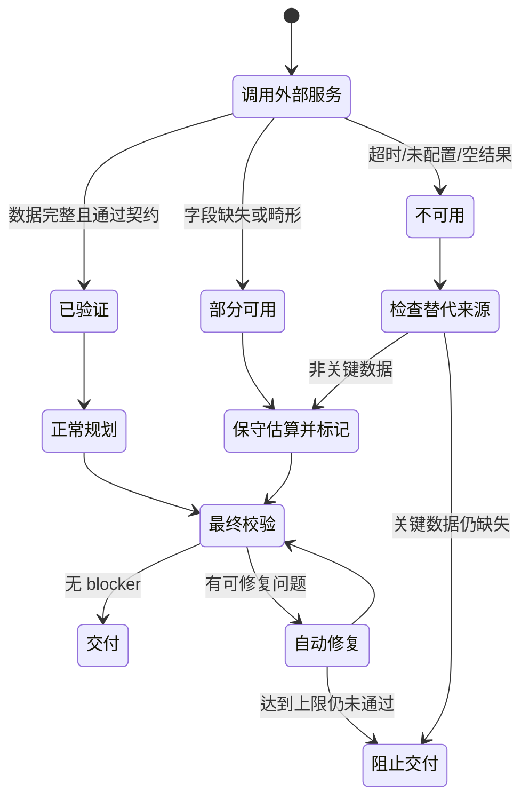
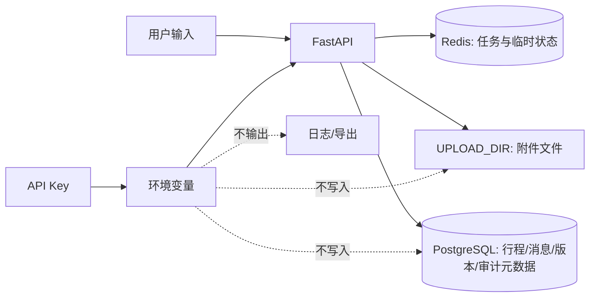

# 优化方向四：安全边界与诚实降级展示

## 1. RoadMan 能做什么

RoadMan 用于出发前规划和行程修改。代码不接入 CAN 总线、车机控制、自动驾驶或驾驶辅助执行接口，也不控制方向、制动、动力、充电、车门和导航下发。


驾驶时应以车辆仪表、实时导航、交通与气象部门公告、景区或交通运营方通知和现场判断为准。导出的路书不能用作自动驾驶指令、应急处置结论或车辆性能承诺。

## 2. 外部服务失败后的处理



系统会区分两类情况。缺少非关键字段时可以采用保守估算，但必须标注；缺少路线、能量或时间等关键事实且无法替代时，停止交付。

## 3. 用户能看到的降级状态

| 异常 | 系统处理 | 页面说明 |
|---|---|---|
| 一个首页天气源失败 | 继续使用其他可用来源，保留每个来源状态 | 显示实际采用的 provider 和失败警告 |
| 多个首页天气源温差达到 8 摄氏度 | 使用优先级最高的可用结果 | 提示出发前复核来源差异 |
| 四个首页天气源全部失败 | 天气卡停止加载并显示不可用 | 不生成当前温度或天气状况 |
| 行程逐时天气不可用 | 使用基础风险提示 | `WEATHER_DATA_DEGRADED`，不写成逐时预报 |
| 天气字段部分畸形 | 丢弃坏字段，保留可解析字段 | `WEATHER_DATA_PARTIAL` |
| 补能服务中断 | 在路线上给出估算检查位置 | `ENERGY_STOP_ESTIMATED`，路线需要人工确认 |
| 充电功率缺失 | 取车辆上限与 60kW 中较小的值 | `CHARGING_POWER_ESTIMATED` 和计算依据 |
| 车辆电量或容量越界 | 限制到有效范围并采用保守默认值 | `VEHICLE_ENERGY_DATA_NORMALIZED` |
| 地图 geometry 缺失 | 绘制带说明的示意线 | 不称为真实道路轨迹 |
| 班次、票务或开放状态缺失 | 保持 unknown 或 unavailable | 不虚构车次、航班号、票价和营业状态 |
| 语义模型不可用 | 暂停需要语义判断的步骤 | 不用关键词猜地点含义 |
| 浏览器拒绝定位 | 临时失败时可读取本机保存的上次天气坐标 | 不回退到固定城市，不上传位置历史 |

首页天气会并发查询 Open-Meteo、wttr.in、MET Norway 和 7Timer，优先采用首个可用结果。高德反向地理编码只把浏览器坐标转成可读地点名。行程规划使用 Open-Meteo 的逐时数据，并结合预计抵达时间、路线海拔和景点适配检查。不同接口互相补充，但不会把地点标签、路线时刻或规则判断称为独立气象观测。


> 图 1：12 个异常场景的自动评测。路线直接可执行率为 91.67%，其中一个补能服务中断场景按设计要求人工确认。

## 4. 12 个异常场景

| ID | 输入风险 | 预期结果 |
|---|---|---|
| `low-soc-long-distance` | 低 SOC 和长途 | 安排补能与强制休息，SOC 连续 |
| `adverse-weather` | 强降水、低能见度、大风、高温 | 四类风险均显示 |
| `energy-facilities-insufficient` | 充电服务没有结果 | 生成估算检查点，路线标为需确认 |
| `vehicle-information-missing` | 缺少车辆资料 | 使用默认车并说明数据缺失 |
| `external-services-error` | 天气服务失败 | 保留基础风险，不阻断短途计划 |
| `overreported-charge-capped` | 补能量超过电池空间 | SOC 封顶 100% |
| `vehicle-charge-power-cap` | 桩功率超过车辆能力 | 按车辆 90kW 上限计算 |
| `invalid-charger-metadata` | 0 功率、负补能量、非法时长 | 忽略坏值，保守估算并告警 |
| `fuel-service-measured` | 燃油车实际补入 18L | 按实际油量更新，不固定重置 |
| `partial-weather-payload` | 数字字符串、NaN 和 unknown 混合 | 采用可解析字段，标记部分可用 |
| `invalid-vehicle-energy-metadata` | SOC 180%、电池容量为负数 | 归一化并说明 |
| `short-trip-no-optional-services` | 短途且没有可选服务 | 不误报必须补能或休息 |

当前 12/12 符合预期，降级处理成功率为 100%，路线直接可执行率为 91.67%。需要人工确认的案例是补能服务没有返回真实候选，只剩估算位置。

## 5. 数据收集、存储和删除

### 5.1 收集范围

系统保存用户主动输入的行程需求、车辆规划参数、对话、编辑状态、行程版本、上传附件和任务状态。外部服务审计记录 provider、成功状态、延迟、错误码与来源摘要。

默认不需要身份证、支付信息、车牌、VIN、精确家庭地址或持续位置轨迹。首页天气在用户授权后使用当前坐标；浏览器可在本地保存最近一次坐标，用于临时失败回退。坐标不写入 Trip，服务端不保存位置历史。用户也不应在提示词或附件中提交不必要的敏感信息。

### 5.2 存储位置



模型私有思维链不落库。调用审计不保存请求头、密钥或完整的 provider 原始响应。

### 5.3 删除行为

用户删除行程时，后端同步清理行程文档、日计划、消息、规划状态、后台任务、保存版本、PlanPatch、关联附件和该行程的 Skill 调用记录。附件默认保留 30 天，可通过 `FILE_RETENTION_DAYS` 调整。

当前执行的是不可恢复的硬删除，前端会要求二次确认。系统级健康汇总没有关联到具体行程，不随单条行程删除。

## 6. 安全测试与审计

```powershell
# 后端边界、删除级联、规划与 provider 降级
pytest backend/tests -q

# 12 个异常与降级场景
python evaluation/safety_scenarios.py

# 运行中 API、临时对象创建与清理
python deploy/api_smoke.py

# 复赛摘要
python evaluation/semifinal_readiness.py --base-url http://127.0.0.1:8000
```

运行观测页和 `/api/v1/skills/calls` 可以查询调用结果、缓存、延迟与错误码。公开截图不能包含 API Key、附件原文或精确私人位置。

## 7. 公网 Demo 仍缺什么

当前受控 Demo 已使用容器隔离、数据库持久化、健康检查、环境变量密钥和行程级联删除。正式多人服务还需要补充或持续验证 HTTPS、账号与资源级鉴权、租户隔离、限流和 WAF、密钥托管、隐私告知与授权撤回、数据导出请求、加密备份及第三方数据授权。

因此对外名称保持“受控公网 Demo”，不承诺生产级服务或 SLA。

## 8. 现场核对

先打开正常规划，查看 adopted 地点的来源。再运行天气和补能服务失败案例，核对页面是否保留可用部分、显示错误状态，并在关键数据不足时把路线改为需确认。最后删除测试行程，检查消息、版本、任务、附件和关联审计是否一并清理。
