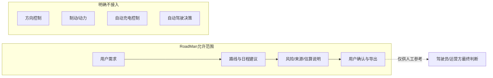
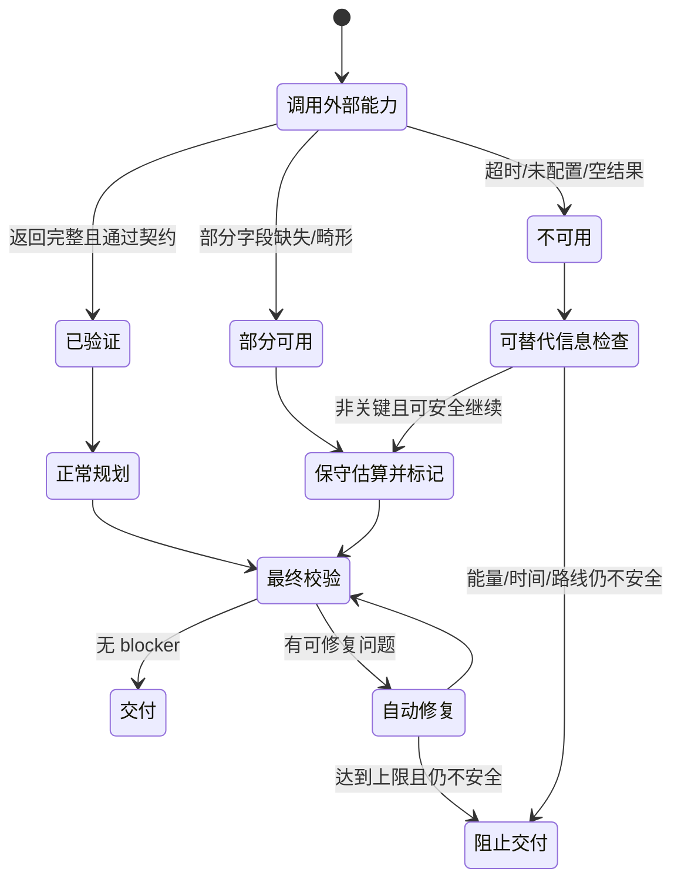
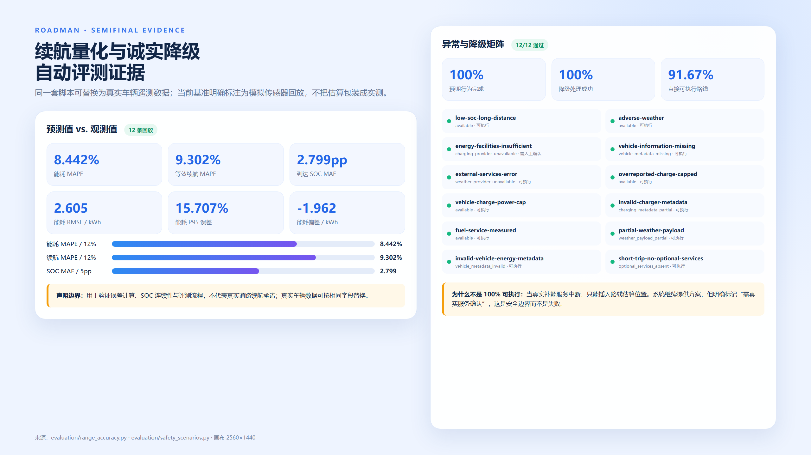

# 优化方向四：安全边界与诚实降级展示

## 1. 产品责任边界

RoadMan 是出发前和修改阶段的规划辅助系统，不是车辆控制系统。当前代码不接入 CAN 总线、车机控制、自动驾驶或驾驶辅助执行接口，不控制方向、制动、动力、充电、车门或导航下发。



实时导航、车辆仪表、交通和气象主管部门公告、景区/交通运营方信息及驾驶员现场判断始终具有更高优先级。导出路书不能作为自动驾驶指令、应急处置结论或车辆性能承诺。

## 2. 诚实降级状态机



降级不是把所有错误都放过。它区分“信息不完整但可安全继续”和“缺少关键事实导致不可执行”。

## 3. 用户可见的降级规则

| 异常 | 系统行为 | 用户看到的边界 |
|---|---|---|
| 天气服务不可用 | 使用基础风险模型继续 | `WEATHER_DATA_DEGRADED`，不写成逐时预报 |
| 天气部分字段畸形 | 忽略坏字段、使用可解析字段 | `WEATHER_DATA_PARTIAL`，仍可识别有效强降水字段 |
| 补能服务中断 | 按路线插入估算检查位置 | `ENERGY_STOP_ESTIMATED`，需出发前确认，路线不计为直接可执行 |
| 充电功率缺失 | 车辆上限与 60kW 取小 | `CHARGING_POWER_ESTIMATED` 和计算依据 |
| 车辆电量/余量越界 | 限制到安全范围并采用保守默认值 | `VEHICLE_ENERGY_DATA_NORMALIZED` |
| 地图 geometry 缺失 | 只画带说明的示意线 | 不把直线称为真实道路轨迹 |
| 班次/票务/开放状态缺失 | 保持 unknown/unavailable | 不虚构车次、航班号、票价或营业状态 |
| 语义模型不可用 | 暂停需要语义判断的步骤 | 不用关键词猜“新疆”是餐馆或校园 |



> 图 1：12 个异常/降级场景的自动评测，原始画布 2560×1440。路线直接可执行率不是 100%，因为估算补能点必须人工确认。

## 4. 12 个异常与奇怪案例

| ID | 主要风险 | 预期结果 |
|---|---|---|
| `low-soc-long-distance` | 低 SOC + 长途 | 安排真实补能与强制休息，SOC 连续 |
| `adverse-weather` | 强降水、低能见度、大风、高温 | 四类风险全部显式出现 |
| `energy-facilities-insufficient` | 充电服务无结果 | 生成估算检查点，路线标为需确认 |
| `vehicle-information-missing` | 没有车辆资料 | 使用默认车并披露车辆数据缺失 |
| `external-services-error` | 天气服务失败 | 基础风险继续，不阻断短途计划 |
| `overreported-charge-capped` | 补能量超过电池空间 | SOC 封顶 100% |
| `vehicle-charge-power-cap` | 桩功率超过车辆能力 | 按车辆 90kW 上限计算 |
| `invalid-charger-metadata` | 0 功率、负补能量、非法时长 | 忽略坏值，保守估算并告警 |
| `fuel-service-measured` | 燃油车 + 实测 18L | 按实测油量更新，不固定重置 |
| `partial-weather-payload` | 数字字符串、NaN、unknown 混合 | 解析可用字段并标记部分可用 |
| `invalid-vehicle-energy-metadata` | SOC 180%、电池负数 | 归一化并披露 |
| `short-trip-no-optional-services` | 短途且无可选服务 | 不误报必须补能/休息 |

当前 12/12 符合预期，降级处理成功率 100%，路线直接可执行率 91.67%。唯一不直接可执行的场景正是“真实补能服务中断、只有估算位置”，这是有意设计的诚实边界。

## 5. 数据最小化、存储与删除

### 5.1 收集什么

- 用户主动输入的行程需求、车辆规划参数、对话和编辑状态；
- 行程版本、上传附件、规划任务状态；
- 外部能力调用的 provider、成功状态、延迟、错误码和来源摘要。

默认不需要身份证、支付信息、车牌、VIN、精确家庭住址或持续位置轨迹。界面和文档应提示用户不要在提示词与附件中提交这些信息。

### 5.2 存在哪里


模型私有思维链不落库。调用审计不保存请求头、密钥或完整 provider 原始响应。

### 5.3 如何删除

用户删除行程时，后端级联清理：

- 行程文档、日计划与消息；
- 规划状态和后台任务；
- 保存版本与 PlanPatch；
- 关联附件元数据和安全目录内的实体文件；
- 与该行程关联的 Skill 调用记录。

附件默认保留 30 天，可通过 `FILE_RETENTION_DAYS` 调整。当前删除是不可恢复的硬删除，前端执行前需要二次确认。未关联具体行程的系统健康汇总不随单条行程删除。

## 6. 安全测试与审计证据

```powershell
# 后端边界、删除级联、规划与 provider 降级
pytest backend/tests -q

# 12 个异常与降级场景
python evaluation/safety_scenarios.py

# 运行中 API、临时对象创建与清理
python deploy/api_smoke.py

# 机器可读/人类可读复赛摘要
python evaluation/semifinal_readiness.py --base-url http://127.0.0.1:8000
```

运行观测页面与 `/api/v1/skills/calls` 可追踪成功状态、缓存、延迟与错误码；截图或公开演示时不得展示 API Key、用户附件原文或精确私人位置。

## 7. 公网 Demo 上线前置条件

当前本地/局域网 Demo 已有容器隔离、数据库持久化、健康检查、环境变量密钥和级联删除，但公网多用户上线前仍必须增加：

1. HTTPS 与受管域名；
2. 账号鉴权、强密码/MFA、租户隔离；
3. 速率限制、配额、审计告警和 WAF；
4. 密钥托管与定期轮换；
5. 隐私告知、授权撤回、数据导出和数据主体请求流程；
6. 备份加密、恢复演练与保留周期；
7. 第三方数据授权、缓存期限和用途边界复核。

这些项目在完成前应明确标为“受控 Demo”，不能把局域网可访问等同于生产级公网服务。

## 8. 复赛演示脚本

1. 展示正常规划及每个 adopted 地点的来源。
2. 切换到天气不可用案例，说明系统保留基础风险但不伪造逐时天气。
3. 切换到补能服务中断案例，指出路线仍可阅读，但“直接可执行”被降为需确认。
4. 展示异常桩功率与 SOC 封顶计算。
5. 删除测试行程，证明消息、版本、任务、附件和行程审计同步清理。
6. 最后明确“不接车辆控制，驾驶员和实时官方信息拥有最终决定权”。

